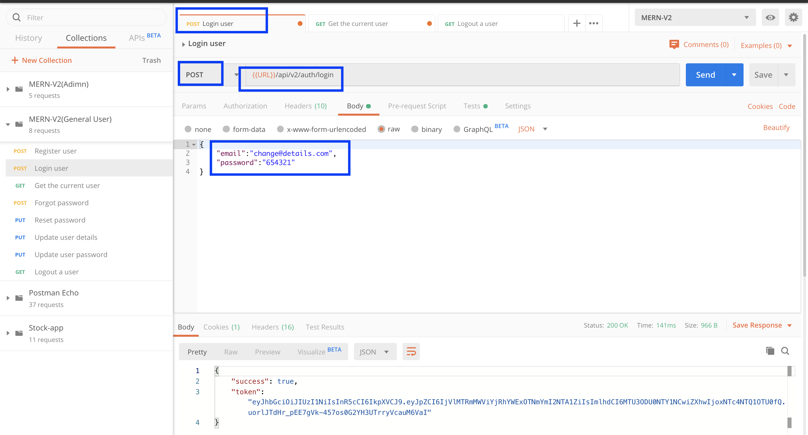
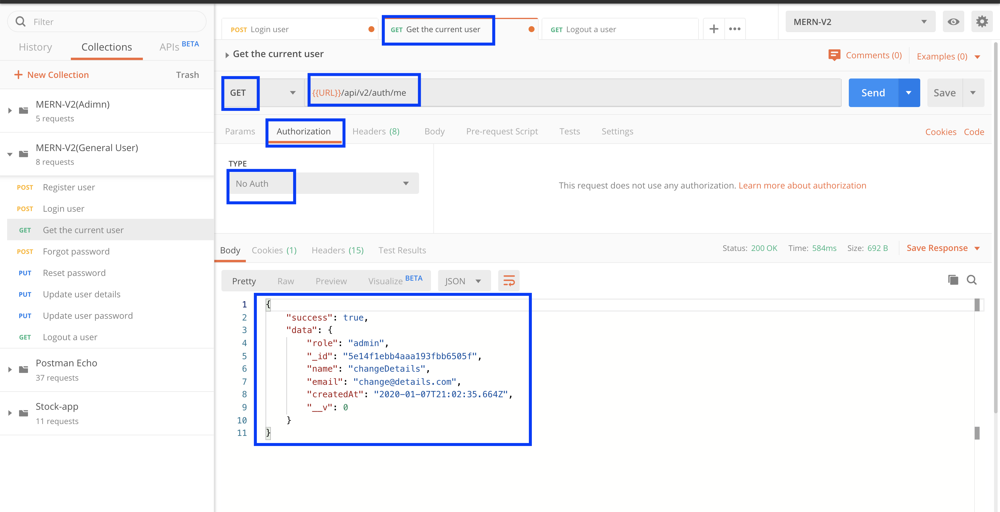
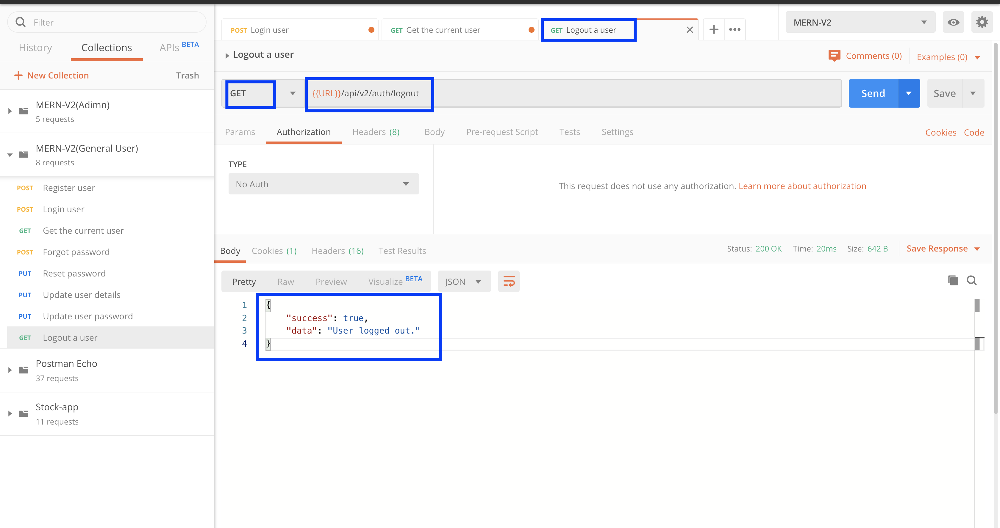
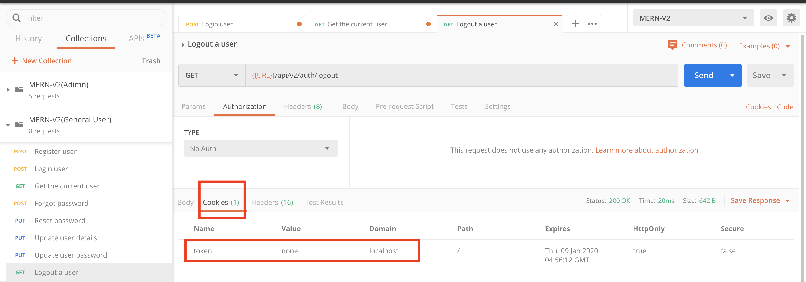
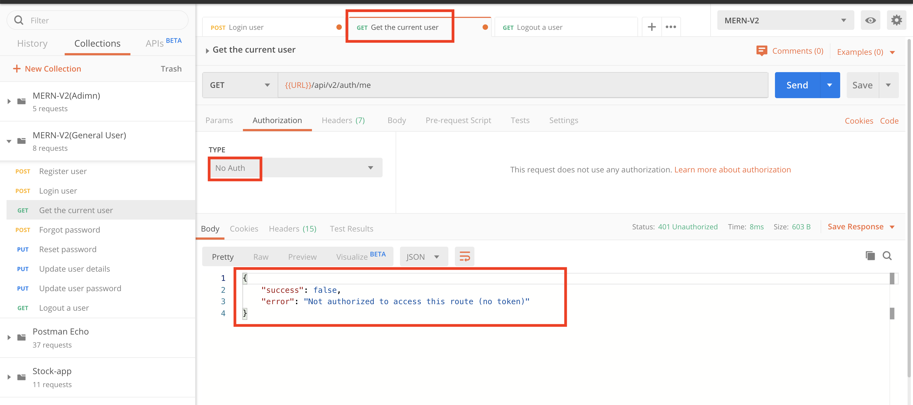

# MERN-Template-V2(Part 8)

## `Section: Backend`(API security)。

### `Summary`: In this documentation, we add API security. 

### `Check Dependencies`

(Back-end)
- express (part1)
- dotenv (part1)
- morgan (part1)
- mongoose (part2)
- colors (part2)
- jsonwebtoken (part2)
- bcryptjs (part2)
- cookie-parser (part3)
- nodemailer(part5)
- crypto(part5)

```diff
+ express-mongo-sanitize
+ helmet
+ xss-clean
+ express-rate-limit
+ hpp
+ cors
```

(Dev-dependencies)
- nodemon (part1)

### Designing path:
1. 练习添加新的API。

### `Brief Contents & codes position.`
- 8.1 Add logout route middleware, `Location:./controllers/auth.js`
- 8.2 Add the mew middleware to route, `Location:./apis/auth.js`
- 8.3 Set token from cookie, `Location:./middleware/auth.js`

---------------------------------------------
- 8.4 Add pre-defined middlewares, `Location:./server.js`

### `Step1: Add logout route middleware`
#### `Location:./controllers/auth.js`

```js
// @desc       Log user out / clear cookie
// @route      Get /api/v2/auth/logout
// @access     Private
exports.logout = async (req, res, next) => {
    try {
        res.cookie('token', 'none', {
            expires: new Date(Date.now() + 10 * 1000),
            httpOnly: true,
        });

        res.status(200).json({
            success: true,
            data: `User logged out.`
        })

    } catch (err) {
        next(err);
    }
};
```

### `Comments:`
- 这个只当token在cookie时使用，之前都是在postman中使用Bearer token，token都自动存在postman中。
- 疑问，logout是private吗，因为没有经过protect middleware.

### `Step2: Add the mew middleware to route.`
#### `(*8.1)Location:./apis/auth.js`

```js
const router = require('express').Router();
const {
    register,
    login,
    getMe,
    forgotPassword,
    resetPassword,
    updateDetails,
    updatePassword,
    logout
} = require('../controllers/auth');

const { protect } = require('../middleware/auth')

router.post('/register', register);
router.post('/login', login);
router.get('/logout', logout);
router.get('/me', protect, getMe);
router.put('/updatedetails', protect, updateDetails);
router.put('/updatepassword', protect, updatePassword);
router.post('/forgotpassword', forgotPassword);
router.put('/resetpassword/:resettoken', resetPassword);

module.exports = router;
```

### `Comments:`
- 正常添加`middleware`.

### `Step3: Set token from cookie.`
#### `(*8.2)Location:./middleware/auth.js`

```js
const User = require('../models/User');
const jwt = require('jsonwebtoken');
const ErrorResponse = require('../utils/errorResponse');

//Check if the token is valid
exports.protect = async (req, res, next) => {
  let token;

  // Set token from Bearer token in header
  if (req.headers.authorization && req.headers.authorization.startsWith('Bearer')) {
    token = req.headers.authorization.split(' ')[1];
  }
  // Set token from cookie
  else if (req.cookies.token) {
    token = req.cookies.token
  }

  // Make sure token exists
  if (!token) {
    return next(new ErrorResponse('Not authorized to access this route (no token)', 401));
  }

  try {
    const decoded = jwt.verify(token, process.env.JWT_SECRET);
    req.user = await User.findById(decoded.id);
    next(); // pre route middleware

  } catch (err) {
    return next(new ErrorResponse('Not authorized to access this route (invalid token)', 401)); // Catch error and stop.
  }
}

//Grand access to specific roles
exports.authorize = (...roles) => {
  return (req, res, next) => {
    if (!roles.includes(req.user.role)) {
      return next(new ErrorResponse(`User role ${req.user.role} is not authorized to access this route`, 403));
    }
    next();
  }
}
```

### `Comments:`
- 主要设定是这一段：
```js
  // Set token from Bearer token in header
  if (req.headers.authorization && req.headers.authorization.startsWith('Bearer')) {
    token = req.headers.authorization.split(' ')[1];
  }
  // Set token from cookie
  else if (req.cookies.token) {
    token = req.cookies.token
  }
```
- 上面这一段的意思是如果没有对postman的token进行设定，就检测cookie上面有没有token。

### `Step4: Add pre-defined middlewares.`
#### Install dependencies
```bash
$ npm i express-mongo-sanitize
$ npm i helmet
$ npm i xss-clean
$ npm i express-rate-limit
$ npm i hpp
$ npm i cors
```

#### `(*8.3)Location:./server.js`
```js
//Load env vars
const dotenv = require('dotenv');
dotenv.config({ path: './config/config.env' });
const PORT = process.env.PORT || 5000;

// packages
const express = require('express');
const morgan = require('morgan');
const colors = require('colors');
const cookieParser = require('cookie-parser');
const mongoSanitize = require('express-mongo-sanitize');
const helmet = require('helmet');
const xss = require('xss-clean');
const rateLimit = require('express-rate-limit');
const hpp = require('hpp');
const cors = require('cors');

// middleware
const connectDB = require('./config/db');
const errorHandler = require('./middleware/error');

//Server
const app = express();

//DB
connectDB();

//Middlewares
app.use(express.json());
app.use(cookieParser());

if (process.env.NODE_ENV === 'development') {
    app.use(morgan('dev'));
}

// Sanitize data
app.use(mongoSanitize());

// Set security headers
app.use(helmet());

// Prevent XSS attacks
app.use(xss());

// Rate limiting
const limiter = rateLimit({
    windowMs: 10 * 60 * 1000, // 10 min
    max: 100,
});
app.use(limiter);

// Prevent http param pollution
app.use(hpp());

// Enable CORS
app.use(cors());

/*
Routes here!!
*/
app.use('/api/v2', require('./apis'));

//Error handler middleware after route.
app.use(errorHandler);

const server = app.listen(PORT, () => console.log(`server is listening on port ${PORT} ===>`));

//Handle unhandled promise rejection
process.on('unhandledRejection', (err, promise) => {
    console.log(`Error: ${err.message}`.red.bold);
    server.close(() => process.exit(1));
})
```

### `Comments:`
- 主要添加的代码：
```js
const mongoSanitize = require('express-mongo-sanitize');
const helmet = require('helmet');
const xss = require('xss-clean');
const rateLimit = require('express-rate-limit');
const hpp = require('hpp');
const cors = require('cors');

// Sanitize data(防 $gt:"")
app.use(mongoSanitize());

// Set security headers(防 头部感染)
app.use(helmet());

// Prevent XSS attacks（防 内加script）
app.use(xss());

// Rate limiting（限速）
const limiter = rateLimit({
    windowMs: 10 * 60 * 1000, // 10 min
    max: 100,
});
app.use(limiter);

// Prevent http param pollution（防 参数乱写）
app.use(hpp());

// Enable CORS （允许跨域资源共享）
app.use(cors());
```

### Step5 : TEST

- Login a user.
<p align="center">

</p>

- Send a getMe request and set the token from cookie.
<p align="center">

</p>

- Logout the user.
<p align="center">

</p>
----------------------------------------
<p align="center">

</p>

- Send a getMe request again.
<p align="center">

</p>