# MERN-Template-V2(Part 7)

## `Section: Backend`(Update User details and password APIs)。

### `Summary`: In this documentation, we add update user apis. 

### `Check Dependencies`

(Back-end)
- express (part1)
- dotenv (part1)
- morgan (part1)
- mongoose (part2)
- colors (part2)
- jsonwebtoken (part2)
- bcryptjs (part2)
- cookie-parser (part3)
- nodemailer(part5)
- crypto(part5)

(Dev-dependencies)
- nodemon (part1)

### Designing path:
1. 练习添加新的API。

### `Brief Contents & codes position.`
- 6.1 Add update details route endpoint middleware, `Location:./controllers/auth.js`
- 6.2 Add update password route endpoint middleware, `Location:./controllers/auth.js`
- 6.3 Add the two new route endpoint middlewares in route to two new apis, `Location:./apis/auth`

### `Step1: Add update email and name route endpoint middleware`
#### `Location:./controllers/auth.js`

```js
// @desc       Update user details
// @route      PUT /api/v2/auth/updatedetails
// @access     Private
exports.updateDetails = async (req, res, next) => {
    try {
        const fielsToUpdate = {
            name: req.body.name,
            email: req.body.email,
        }
        const user = await User.findByIdAndUpdate(req.user.id, fielsToUpdate, {
            new: true,
            runValidators: true,
        })

        res.status(200).json({
            success: true,
            data: user
        })

    } catch (err) {
        next(err);
    }
};
```

### `Comments:`
- 注意这里使用到的是部分修改user info的概念，跟第五部分修改resetPasswordToken和resetPasswordExpire，是相似的，但使用的工具是不一样的，这里需要多对比分辨。
- `这里也是常用的更新部分info的方法。`

### `Step2: Add update password route endpoint middleware`
#### `Location:./controllers/auth.js`

```js
// @desc       Update user password
// @route      PUT /api/v2/auth/updatepassword
// @access     Private
exports.updatePassword = async (req, res, next) => {
    try {
        const user = await User.findById(req.user.id).select('+password');
        if (!(await user.matchPassword(req.body.currentPassword))) {
            return next(new ErrorResponse('Password is incorrect', 401))
        }

        user.password = req.body.newPassword;
        await user.save();

        sendTokenResponse(user, 200, res)

    } catch (err) {
        next(err);
    }
};
```

### `Comments:`
- 注意这里使用读取用户时使用到`select('password')`, 然后经过对比原密码成功后直接保存，最后调用`sendTokenResponse`来保持登陆状态。
- 这里小结一下在本app里面用到了很多修改user info并保存在DB的不同方法，后期可以多总结。

### `Step3: Add the new route endpoint middleware in route to build new api.`
#### `(*6.1)Location:./apis/auth.js`

```js
const router = require('express').Router();
const {
    register,
    login,
    getMe,
    forgotPassword,
    resetPassword,
    updateDetails,
    updatePassword
} = require('../controllers/auth');

const { protect } = require('../middleware/auth')

router.post('/register', register);
router.post('/login', login);
router.get('/me', protect, getMe);
router.put('/updatedetails', protect, updateDetails);
router.put('/updatepassword', protect, updatePassword);
router.post('/forgotpassword', forgotPassword);
router.put('/resetpassword/:resettoken', resetPassword);

module.exports = router;
```

### `Comments:`
- 要注意新增的两个route endpoint middleware都是Private的，换句话说都需要protect middleware去验证用户是否登陆或者cookies里面的token是否有效。

#### `(*6.2)Location:./controllers/auth.js`
```js
const User = require('../models/User');
const ErrorResponse = require('../utils/errorResponse');
const sendEmail = require('../utils/sendEmail');
const crypto = require('crypto');

const sendTokenResponse = (user, statusCode, res) => {
    const token = user.getSignedJwtToken();
    const options = {
        expires: new Date(Date.now() + process.env.JWT_COOKIE_EXPIRE * 24 * 60 * 60 * 1000),
        httpOnly: true
    }

    //For production
    if (process.env.NODE_ENV === 'production') {
        // for https
        options.secure = true;
    }

    res
        .status(statusCode)
        .cookie('token', token, options)
        .json({
            success: true,
            token: token
        });
}

// @desc       Register user
// @route      Post /api/v2/auth/register
// @access     Public
exports.register = async (req, res, next) => {
    try {
        const { name, email, password, role } = req.body;

        const user = await User.create({
            name,
            email,
            password,
            role
        });
        sendTokenResponse(user, 200, res);

    } catch (err) {
        next(err);
    }
};

// @desc       Login user
// @route      Post /api/v2/auth/register
// @access     Public
exports.login = async (req, res, next) => {
    try {
        // Validate email & password
        const { email, password } = req.body;
        if (!email || !password) {
            return next(new ErrorResponse('Please provide email and password', 400));
        }

        //Check for user
        const user = await User.findOne({ email }).select('+password');
        if (!user) {
            return next(new ErrorResponse('Invalid credentials (email)', 401));
        }

        //Check if password matches (model method)
        const isMatch = await user.matchPassword(password);
        if (!isMatch) {
            return next(new ErrorResponse('Invalid credentials (password)', 401));
        }
        //Create token
        sendTokenResponse(user, 200, res);

    } catch (err) {
        next(err);
    }
};

// @desc       Get current logged in user
// @route      Post /api/v2/auth/me
// @access     Private
exports.getMe = async (req, res, next) => {
    try {
        const user = await User.findById(req.user.id);
        res.status(200).json({
            success: true,
            data: user
        });

    } catch (err) {
        next(err);
    }
};


// @desc       Forgot password
// @route      Post /api/v2/auth/forgotpassword
// @access     Public
exports.forgotPassword = async (req, res, next) => {
    try {
        const user = await User.findOne({ email: req.body.email });

        if (!user) {
            return next(new ErrorResponse(`There is no user with that email`, 404))
        }

        // Get reset token
        const resetToken = user.getResetPasswordToken();

        await user.save({ validateBeforeSave: false });

        // Create reset URL
        const resetUrl = `${req.protocol}://${req.get('host')}/api/v2/auth/resetpassword/${resetToken}`;

        const message = `You are receiving this email because you (or someone else) has requested the reset of a password. Please make a PUT request to: \n\n ${resetUrl}`;

        try {
            await sendEmail({
                email: user.email,
                subject: 'Password reset token',
                message: message
            })
        } catch (err) {
            console.log(err);
            user.resetPasswordToken = undefined;
            user.resetPasswordExpire = undefined;

            await user.save({ validateBeforeSave: false });
            return next(new ErrorResponse('Email could not be sent', 500))
        }

        res.status(200).json({
            success: true,
            data: `Email sent`,
        })

    } catch (err) {
        next(err);
    }
};

// @desc       Reset password
// @route      Put /api/v2/auth/resetpassword/:resettoken
// @access     Private
exports.resetPassword = async (req, res, next) => {
    try {
        const resetPasswordToken = crypto
            .createHash('sha256')
            .update(req.params.resettoken)
            .digest('hex');

        const user = await User.findOne({
            resetPasswordToken: resetPasswordToken,
            resetPasswordExpire: { $gt: Date.now() }
        });

        if (!user) {
            return next(new ErrorResponse('Invalid reset token', 400));
        }

        // Set new password
        user.password = req.body.password;
        user.resetPasswordToken = undefined;
        user.resetPasswordExpire = undefined;
        await user.save();

        sendTokenResponse(user, 200, res);

    } catch (err) {
        next(err);
    }
};

// @desc       Update user details
// @route      PUT /api/v2/auth/updatedetails
// @access     Private
exports.updateDetails = async (req, res, next) => {
    try {
        const fielsToUpdate = {
            name: req.body.name,
            email: req.body.email,
        }
        const user = await User.findByIdAndUpdate(req.user.id, fielsToUpdate, {
            new: true,
            runValidators: true,
        })

        res.status(200).json({
            success: true,
            data: user
        })

    } catch (err) {
        next(err);
    }
};

// @desc       Update user password
// @route      PUT /api/v2/auth/updatepassword
// @access     Private
exports.updatePassword = async (req, res, next) => {
    try {
        const user = await User.findById(req.user.id).select('+password');
        if (!(await user.matchPassword(req.body.currentPassword))) {
            return next(new ErrorResponse('Password is incorrect', 401))
        }

        user.password = req.body.newPassword;
        await user.save();

        sendTokenResponse(user, 200, res)

    } catch (err) {
        next(err);
    }
};
```

### Step4 : TEST

- Register a new user.
<p align="center">
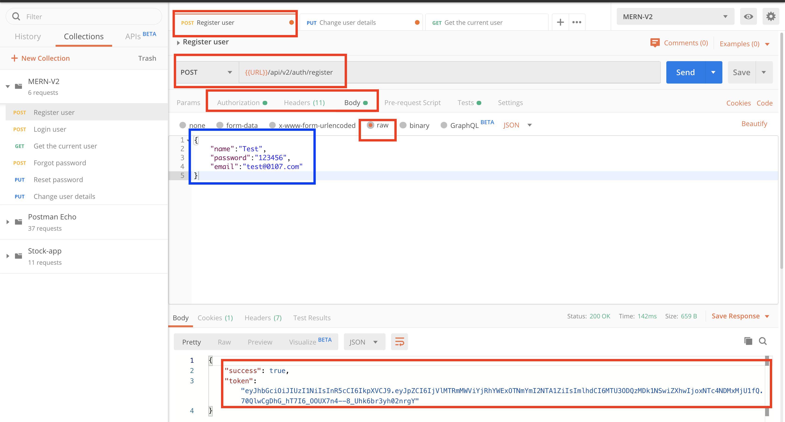
</p>

-----------------------------------------

<p align="center">
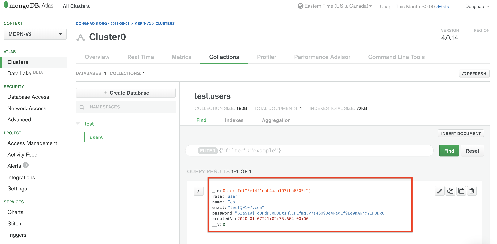
</p>


- Configure the new api request in postman.
<p align="center">
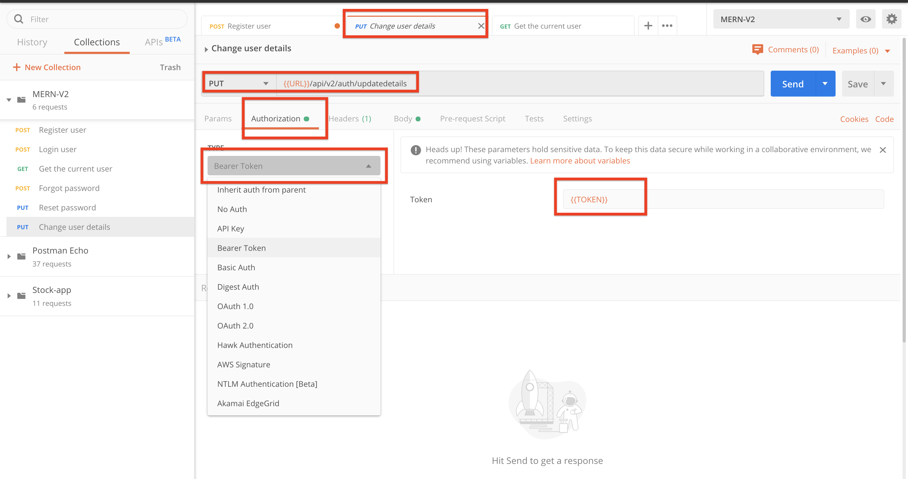
</p>

-----------------------------------------

<p align="center">
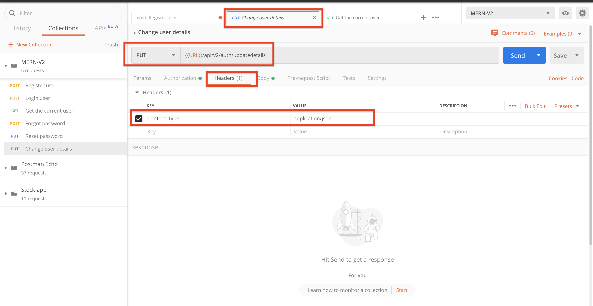
</p>

- Update details with wrong format.
<p align="center">
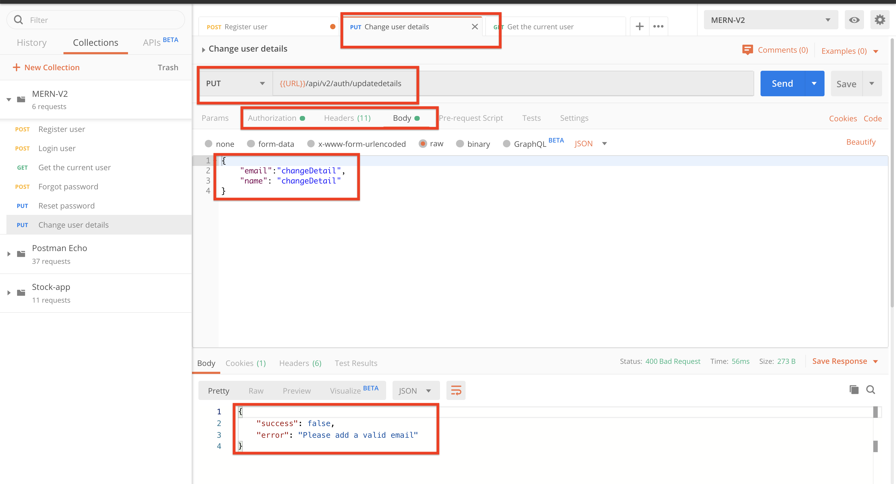
</p>

- Update details with valid format.
<p align="center">
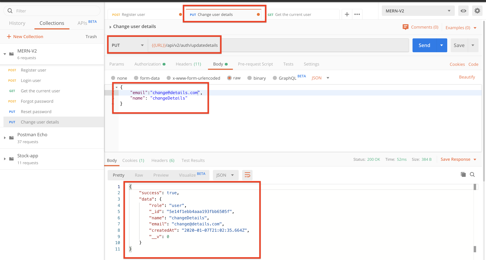
</p>

- Update successfully.
<p align="center">
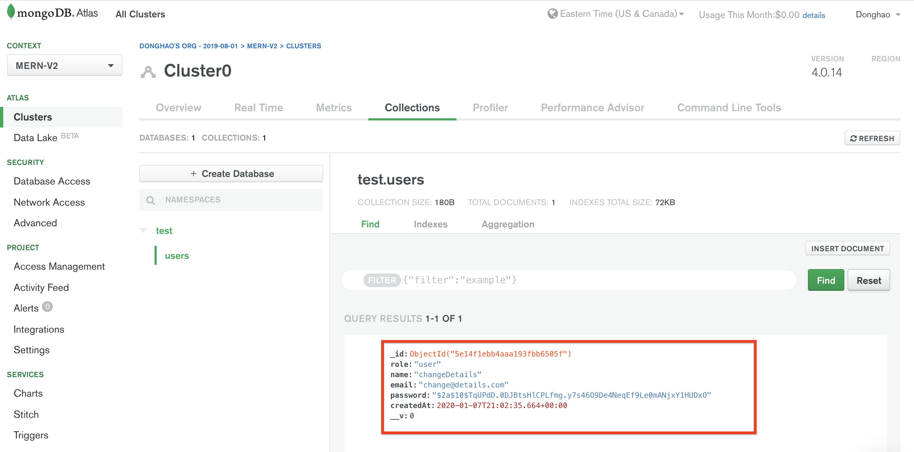
</p>

- Login with the user.
<p align="center">
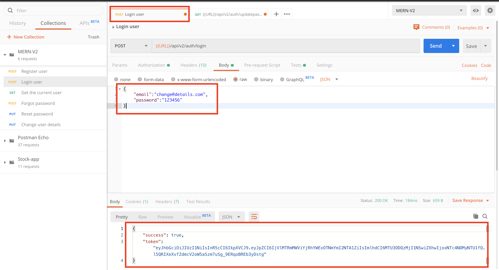
</p>

- Input the current password and new password.
<p align="center">
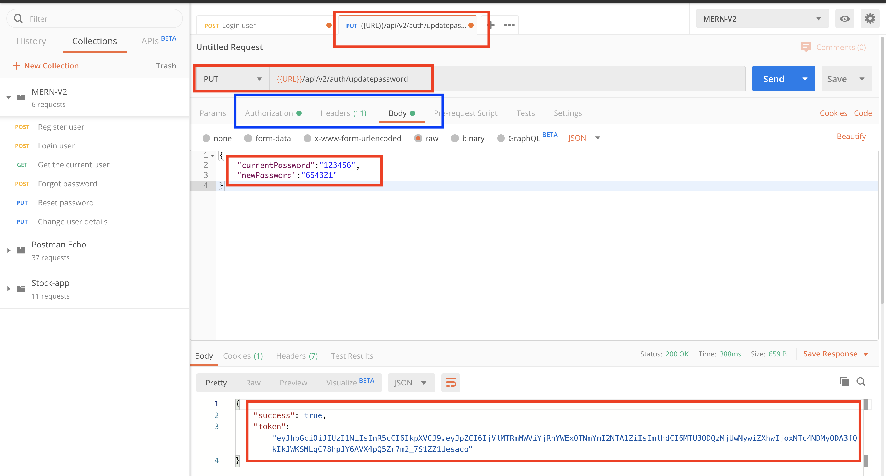
</p>

- Login with old password.
<p align="center">
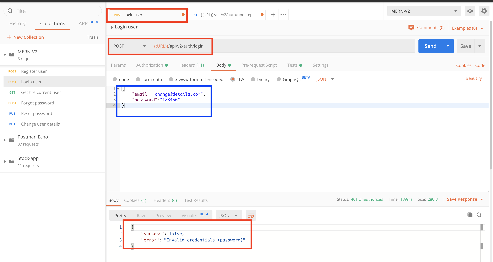
</p>

- Login with new password.
<p align="center">
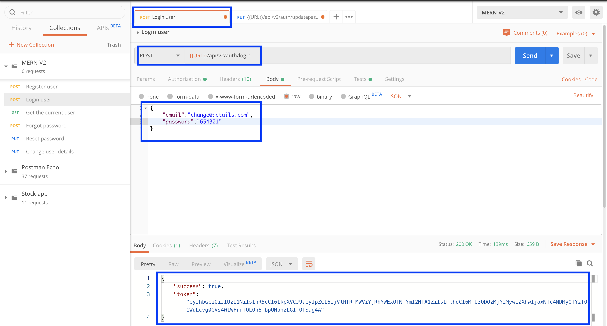
</p>