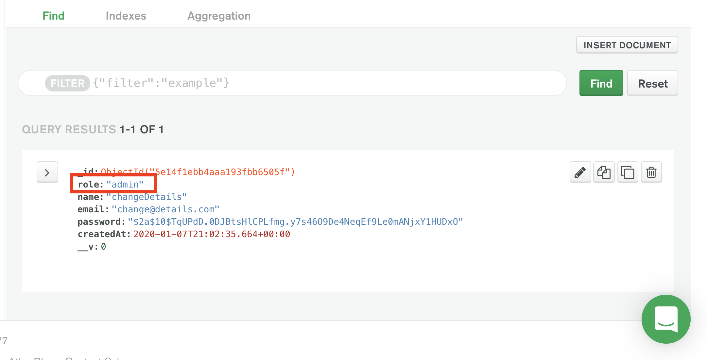
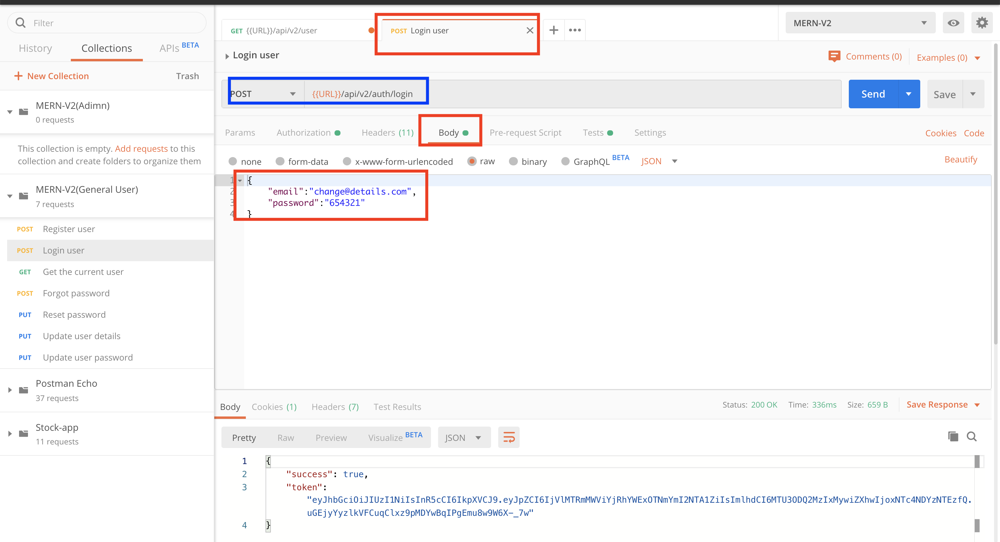
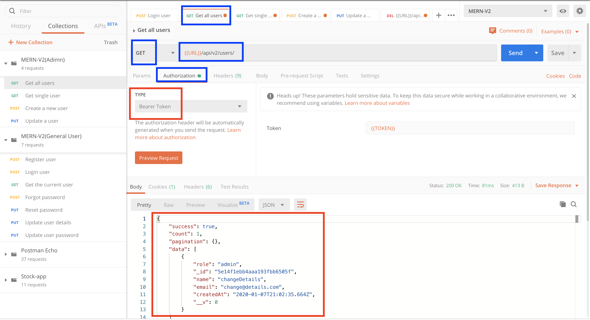
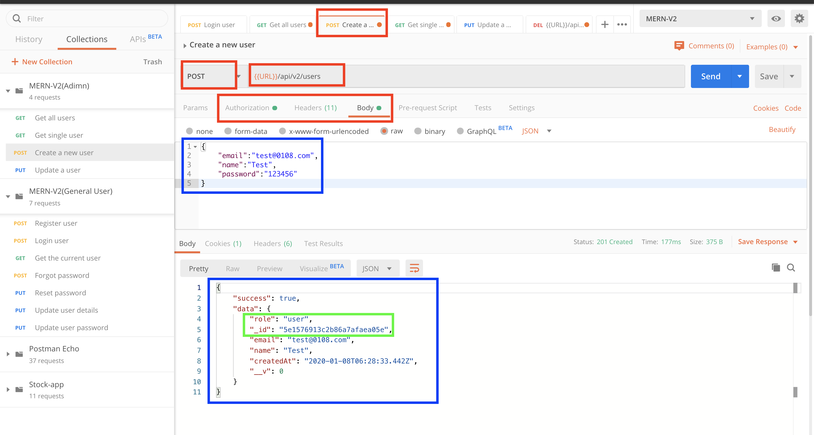
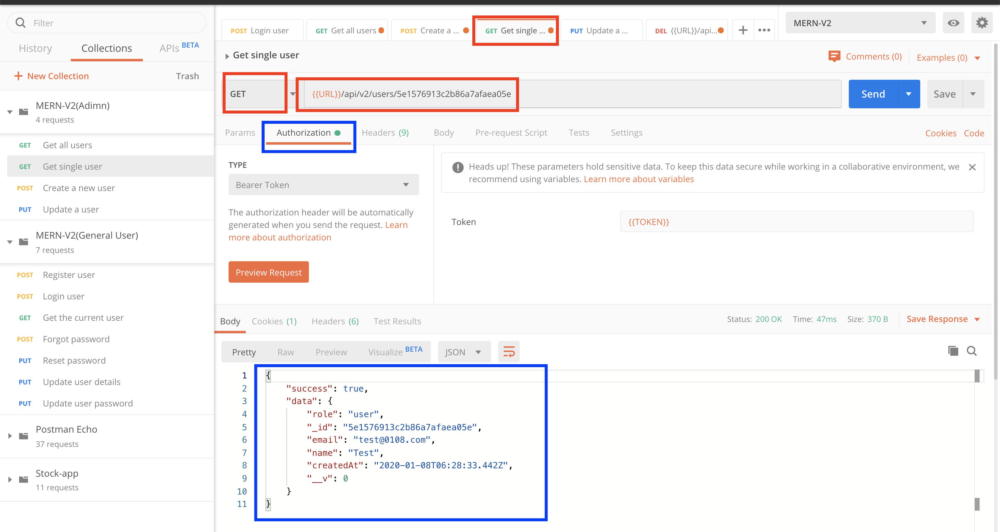
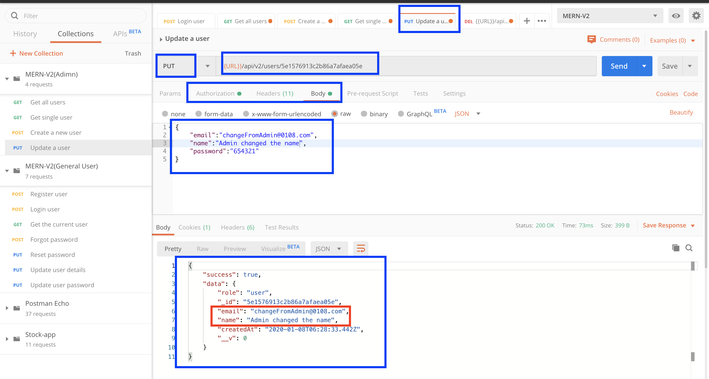
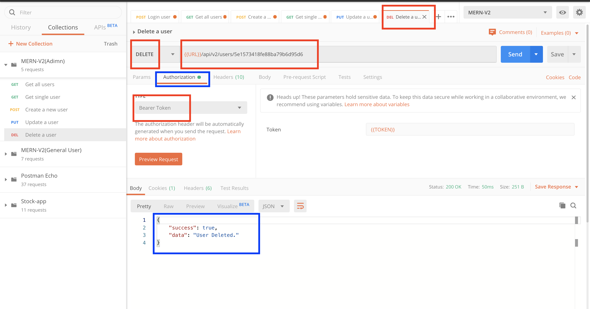

# MERN-Template-V2(Part 7)

## `Section: Backend`(Admin APIs)。

### `Summary`: In this documentation, we add Admin user apis. 

### `Check Dependencies`

(Back-end)
- express (part1)
- dotenv (part1)
- morgan (part1)
- mongoose (part2)
- colors (part2)
- jsonwebtoken (part2)
- bcryptjs (part2)
- cookie-parser (part3)
- nodemailer(part5)
- crypto(part5)

(Dev-dependencies)
- nodemon (part1)

### Designing path:
1. 练习添加新的API。

### `Brief Contents & codes position.`
- 7.1 Add `advancedResults` middleware, `Location:./middleware/advancedResults.js`
- 7.2 Add new route endpoint middlewares, `Location:./controllers/users.js`

- 7.3 Add a brand new route, `Location:./apis/users.js`
- 7.4 Connect the new route, `Location:./apis/index.js`

### `Step1: Add advancedResults middleware`
#### `Location:./middleware/advancedResults.js`

```js
const advancedResults = (model, populate) => async (req, res, next) => {
    let query;

    //Copy query
    const reqQuery = { ...req.query };

    //Fields to exclude
    const removeFields = ['select', 'sort', 'page', 'limit'];

    //Loop over removeFields and delete them from reqQuery
    removeFields.forEach(param => delete reqQuery[param]);

    //Create query string
    let queryStr = JSON.stringify(reqQuery);

    //Create operators ($gt, $gte, etc)
    queryStr = queryStr.replace(/\b(gt|gte|lt|lte|in)\b/g, match => `$${match}`);

    // Finding resource
    query = model.find(JSON.parse(queryStr));//???

    //Select Fields
    if (req.query.select) {
        const fields = req.query.select.split(',').join(' ');
        query = query.select(fields);
    }

    //Sort
    if (req.query.sort) {
        const sortBy = req.query.sort.split(',').join(' ');
        query = query.sort(sortBy)
    }
    else {
        query = query.sort('-createdAt');
    }

    //Pagination
    const page = parseInt(req, query.page, 10) || 1;
    const limit = parseInt(req.query.limit, 10) || 25;
    const startIndex = (page - 1) * limit;
    const endIndex = page * limit;
    const total = await model.countDocuments();

    query = query.skip(startIndex).limit(limit);

    if (populate) {
        query = query.populate(populate);
    }

    // Executing query
    const results = await query;

    // Pagination result
    const pagination = {}
    if (endIndex < total) {
        pagination.next = {
            page: page + 1,
            limit: limit,
        }
    }

    if (startIndex > 0) {
        pagination.prev = {
            page: page - 1,
            limit: limit,
        }
    }

    res.advancedResults = {
        success: true,
        count: results.length,
        pagination: pagination,
        data: results
    }
    next();
};

module.exports = advancedResults;
```

### `Comments:`
- 这个middleware是一个难点，主要是它整合了处理query的功能，后面需要好好分析。

### `Step2: Add new route endpoint middlewares`
#### `(*7.2)Location:./controllers/users.js`

```js
const User = require('../models/User');
const ErrorResponse = require('../utils/errorResponse');

// @desc       Get all users
// @route      Get /api/v2/users
// @access     Private/Admin
exports.getUsers = async (req, res, next) => {
    try {
        res.status(200).json(res.advancedResults);
    } catch (err) {
        next(err);
    }
};

// @desc       Get single user
// @route      Get /api/v2/users/:id
// @access     Private/Admin
exports.getUser = async (req, res, next) => {
    try {
        const user = await User.findById(req.params.id);

        res.status(200).json({
            success: true,
            data: user,
        })
    } catch (err) {
        next(err);
    }
};

// @desc       Create user
// @route      Post /api/v2/users
// @access     Private/Admin
exports.createUser = async (req, res, next) => {
    try {
        const user = await User.create(req.body);
        user.password = undefined;

        res.status(201).json({
            success: true,
            data: user,
        })
    } catch (err) {
        next(err);
    }
};

// @desc       Update user
// @route      Put /api/v2/users/:id
// @access     Private/Admin
exports.updateUser = async (req, res, next) => {
    try {
        const user = await User.findByIdAndUpdate(req.params.id, req.body, {
            new: true,
            runValidators: true,
        });

        res.status(200).json({
            success: true,
            data: user,
        })
    } catch (err) {
        next(err);
    }
};

// @desc       Delete user
// @route      DELETE /api/v2/users/:id
// @access     Private/Admin
exports.deleteUser = async (req, res, next) => {
    try {
        await User.findByIdAndDelete(req.params.id)

        res.status(200).json({
            success: true,
            data: 'User Deleted.'
        })
    } catch (err) {
        next(err);
    }
};


```

### `Comments:`
- 这里一共生成了5个endpoint middlewares.

### `Step3: Add a brand new route.`
#### `(*7.3)Location:./apis/users.js`

```js
const router = require('express').Router();
const {
  getUser,
  getUsers,
  updateUser,
  createUser,
  deleteUser
} = require('../controllers/users');

const User = require('../models/User');

const { protect, authorize } = require('../middleware/auth');
const advancedResults = require('../middleware/advancedResults');

router.use(protect);
router.use(authorize('admin'));

router
  .route('/')
  .get(advancedResults(User), getUsers)
  .post(createUser);

router
  .route('/:id')
  .get(getUser)
  .put(updateUser)
  .delete(deleteUser)

module.exports = router;
```

### `Comments:`
- 注意这里middleware的使用位置。

### `Step4: Connect the new route.`
#### `(*7.4)Location:./apis/index.js`

```js
const router = require('express').Router();

router.use('/auth', require('./auth'));
router.use('/users', require('./users'));

module.exports = router;
```

### `Comments:`
- 总的来说这就是添加新的API的流程，主要是开发middleware，然后生成route，最后连接成为一个API。难点在于开发不同的middleware和不同的逻辑件。


### Step5 : TEST

- Change the user role to 'admin' manually.
<p align="center">

</p>

- Login the admin user in Postman.
<p align="center">

</p>

- Make a request to get all user
<p align="center">

</p>

- Make a request to create a user.

<p align="center">

</p>

- Make a request to get a user by id.
<p align="center">

</p>

- Update a user details by id.
<p align="center">

</p>

- Delete a user by id.
<p align="center">

</p>