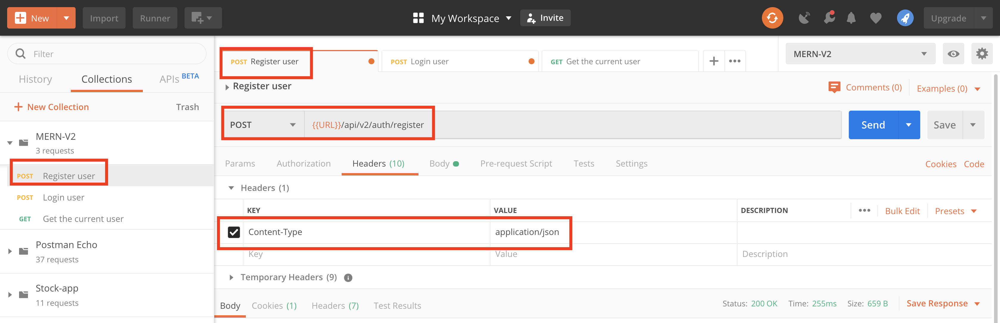
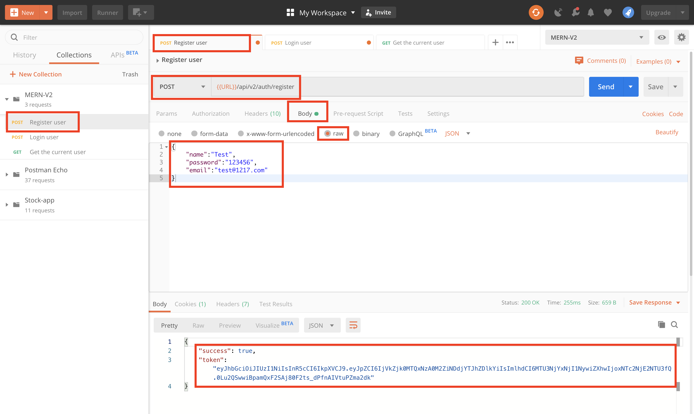
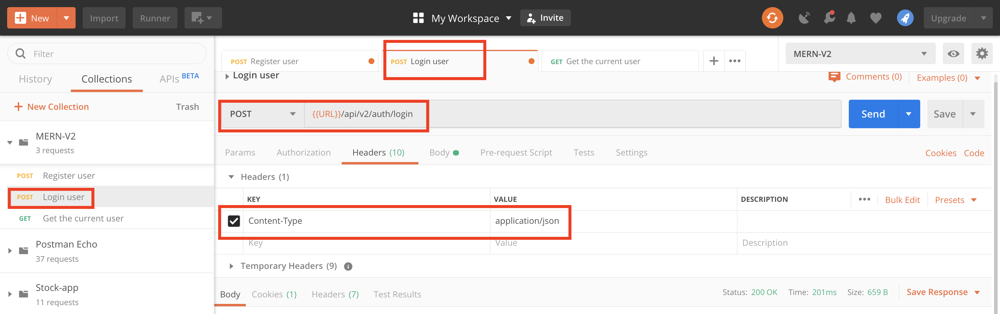
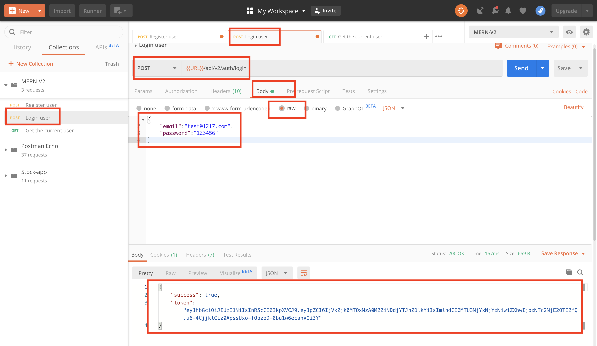
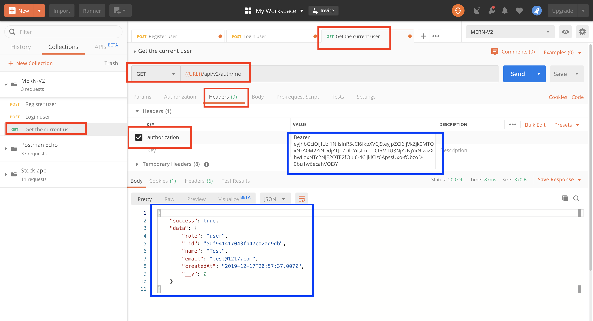

# MERN-Template-V2(part 3)

## `Section: Backend`(Refactor backend Authentication route)。

### `Summary`: In this documentation, we refactor authentication route. （--- 练习使用 Route middleware）

### `Check Dependencies`

(Back-end)
- express (part1)
- dotenv (part1)
- morgan (part1)
- mongoose (part2)
- colors (part2)
- jsonwebtoken (part2)
- bcryptjs (part2)
```diff
+ cookie-parser(new)
```

(Dev-dependencies)
- nodemon (part1)

### `Brief Contents & codes position.`
- 3.1 Add a new User model method, `Location:./models/User.js`
- 3.2 Add login route middleware, `Location:./controllers/auth.js`
- 3.3 Bring login route middleware to route, `Location:./apis/auth.js`
- 3.4 Create a helper function to generate token, store it in cookie, and return it(4 steps)
- 3.5 Create Auth security Middleware (protect) and route middleware (getMe).
- 3.6 Create a Role Authorization security Middleware (authorize).

### `Step1: Add a new User model method`
#### `(*3.1)Location:./models/User.js`

```js
const mongoose = require('mongoose');
const bcrypt = require('bcryptjs');
const jwt = require('jsonwebtoken')

const UserSchema = new mongoose.Schema({
    name: {
        type: String,
        required: [true, 'Please add a name'],
    },
    email: {
        type: String,
        required: [true, 'Please add an email'],
        unique: true,
        match: [
            /^\w+([\.-]?\w+)*@\w+([\.-]?\w+)*(\.\w{2,3})+$/,
            'Please add a valid email'
        ]
    },
    role: {
        type: String,
        enum: ['user', 'publisher'],
        default: 'user'
    },
    password: {
        type: String,
        required: [true, 'Please add a password'],
        minlength: 6,
        select: false,
    },
    resetPasswordToken: String,
    resetPasswordExpire: Date,
    createdAt: {
        type: Date,
        default: Date.now,
    }
});

// Encrypt password using bcrypt
UserSchema.pre('save', async function (next) {
    const salt = await bcrypt.genSalt(10);
    this.password = await bcrypt.hash(this.password, salt);
});

// Sign JWT and return
UserSchema.methods.getSignedJwtToken = function() {
    return jwt.sign({ id: this._id }, process.env.JWT_SECRET, {
        expiresIn: process.env.JWT_EXPIRE
    })
}

// Match user entered password to hashed password in database
UserSchema.methods.matchPassword = async function (enteredPassword) {
    const result = await bcrypt.compare(enteredPassword, this.password);
    return result;
}

module.exports = mongoose.model('User', UserSchema);
```

```diff
+ 重要的事情讲三遍，在mongoDB的model中不能用 arrow function这是很难发现的bug，需要多留意。
- UserSchema.methods.getSignedJwtToken = () => {}
```

### `Step2: Add login route middleware`
#### `Location:./controllers/auth.js`

```js
// @desc       Login user
// @route      Post /api/v2/auth/register
// @access     Public
exports.login = async (req, res, next) => {
    const { email, password } = req.body;

    //Validate email & password
    // if (!email || !password) {
    //     return next(new ErrorResponse('Please provide an email and password', 400))
    // }

    //Check for user
    const user = await User.findOne({ email }).select('+password');

    // if (!user) {
    //     return next(new ErrorResponse('Invalid credentials', 401))
    // }

    //Check if password matched
    const isMatch = await user.matchPassword(password);

    // if (!isMatch) {
    //     return next(new ErrorResponse('Invalid credentials', 401))
    // }

    //Create token
    const token = user.getSignedJwtToken();

    res.status(200).json({
        success:true,
        token: token
    })
}
```
### `Comments:`
- 注释部分包含了下一part的错误控制内容。
- 实现：输入存在的用户和正确的密码，返回token。

### `Step3: Bring login route middleware to route.`
#### `Location:./apis/auth.js`

```js
const router = require('express').Router();
const {
    register,
    login
} = require('../controllers/auth')

router.post('/register', register);
router.post('/login', login)

module.exports = router;
```

### `Step4: Create a helper function to generate token, store it in cookie, and return it.`

#### A. Add new package.
- Install package.
```
$ npm i cookie-parser
```

- Import it.
#### `(*3.2)Location:./server.js`
```js
//Load env vars
const dotenv = require('dotenv');
dotenv.config({ path: './config/config.env' });
const PORT = process.env.PORT || 5000;

//packages
const express = require('express');
const morgan = require('morgan');
const colors = require('colors');
const cookieParser = require('cookie-parser');
const connectDB = require('./config/db');

//Server
const app = express();

//DB
connectDB();

//Middlewares
app.use(express.json());
app.use(cookieParser());

if (process.env.NODE_ENV === 'development') {
    app.use(morgan('dev'));
}

/*
Routes here!!
*/
app.use('/api/v2', require('./apis'));

const server = app.listen(PORT, () => console.log(`server is listening on port ${PORT} ===>`));

//Handle unhandled promise rejection
process.on('unhandledRejection', (err, promise) => {
    console.log(`Error: ${err.message}`.red.bold);
    server.close(() => process.exit(1));
})

```
- 加入以下代码：
```diff
+ const cookieParser = require('cookie-parser');
+ app.use(cookieParser());
```
- 备注：加入了新的library后，可以实现把生成的token储存在cookies中。

#### B.Add new environment variable
#### `(*3.3)Location:./config/config.env`

```js
NODE_ENV=development
PORT=5000

MONGO_URI=mongodb+srv:...

JWT_SECRET=...
JWT_EXPIRE=...
JWT_COOKIE_EXPIRE=...
```

#### C.Create a custom helper function(`本章重点：生成token，生成cookie，返回token`)
#### `Location:./controllers/auth.js`

```js
const sendTokenResponse = (user, statusCode, res) => {
    const token = user.getSignedJwtToken();
    const options = {
        expires: new Date(Date.now() + process.env.JWT_COOKIE_EXPIRE * 24 * 60 * 60 * 1000),
        httpOnly: true
    }

    //For production
    if (process.env.NODE_ENV === 'production') {
        options.secure = true;
    }

    res
        .status(statusCode)
        .cookie('token', token, options) // cookie-parser
        .json({
            success: true,
            token: token
        });
}
```

#### D.Refactor register and login methods
#### `Location:./controllers/auth.js`

```js
//See PartB step5
```

### `Comments:`

- 中间第C步的函数 `sendTokenResponse` 是本说明的重点.

### `Step5: Create Auth security Middleware (protect) and route middleware (getMe).`

#### - `把这个route middleware放在目标route中，作用就是解析token得到id，验证id的有效性，有效就把user信息放到‘req.user’中，然后放行到下一个中间件，没效就报错。`

```diff
+ 在这里需要指出一个点是，为什么在protect中把找到的user信息直接附在req上？ 
+ 因为这个主要的作用在于后续middleware的身份验证或者其他验证，而不是用来显示资料。
```

#### A. Create a middleware method
#### `Location:./middleware/auth.js`

```js
const User = require('../models/User');
const jwt = require('jsonwebtoken');

exports.protect = async (req, res, next) => {
  let token;
  if (req.headers.authorization && req.headers.authorization.startsWith('Bearer')) {
    token = req.headers.authorization.split(' ')[1];
  }

  // else if (req.cookies.token) {
  //   token = req.cookies.token
  // }

  // Make sure token exists
  // if (!token) {
  //   return res.status(400).json({ success: false })
  // }

  try {
    const decoded = jwt.verify(token, process.env.JWT_SECRET);
    req.user = await User.findById(decoded.id);
    next();
  } catch (err) {
    return res.status(400).json({ success: false })
  }
}
```

#### B. Create a new route method (middleware) （getMe）
#### `(*3.4)Location:./controllers/auth.js`

```js
const User = require('../models/User');

const sendTokenResponse = (user, statusCode, res) => {
    const token = user.getSignedJwtToken();
    const options = {
        expires: new Date(Date.now() + process.env.JWT_COOKIE_EXPIRE * 24 * 60 * 60 * 1000),
        httpOnly: true
    }

    //For production
    if (process.env.NODE_ENV === 'production') {
        //https
        options.secure = true;
    }

    res
        .status(statusCode)
        .cookie('token', token, options) // cookie-parser
        .json({
            success: true,
            token: token
        });
}

// @desc       Register user
// @route      Post /api/v2/auth/register
// @access     Public
exports.register = async (req, res, next) => {
    const { name, email, password, role } = req.body;

    const user = await User.create({
        name,
        email,
        password,
        role
    });

    sendTokenResponse(user, 200, res)
}

// @desc       Login user
// @route      Post /api/v2/auth/register
// @access     Public
exports.login = async (req, res, next) => {
    const { email, password } = req.body;

    //Validate email & password
    // if (!email || !password) {
    //     return next(new ErrorResponse('Please provide an email and password', 400))
    // }

    //Check for user
    const user = await User.findOne({ email }).select('+password');

    // if (!user) {
    //     return next(new ErrorResponse('Invalid credentials', 401))
    // }

    //Check if password matched
    const isMatch = await user.matchPassword(password);

    // if (!isMatch) {
    //     return next(new ErrorResponse('Invalid credentials', 401))
    // }

    //Create token
    sendTokenResponse(user, 200, res)
}

// @desc       Get current logged in user
// @route      Post /api/v2/auth/me
// @access     Private
exports.getMe = async (req, res, next) => {
    const user = await User.findById(req.user.id);
    res.status(200).json({
        success: true,
        data: user
    });
}
```

#### C. Import the route method and middleware in route
#### `(*3.5)Location:./apis/auth.js`

```js
const router = require('express').Router();
const {
    register,
    login,
    getMe
} = require('../controllers/auth');

const { protect } = require('../middleware/auth')

router.post('/register', register);
router.post('/login', login);
router.get('/me', protect, getMe)

module.exports = router;
```

### `Comments:`

- 写middleware必须注意两点，第一点是经常需要改变req的内容，第二点是必须有`next()`.
- 在这个设计流程中，经过`protect`中间件的route都会在`req`中取得user全部的信息，而protect中间件的主要作用是在解析token，然后寻找对应的user，如果有user就改变req的内容，如果没有就报错。
- 这个部分很重要，主要练习如何创造和使用route middleware，`同时熟悉protect middleware是怎样运作的。`

### `Step6: Create a Role Authorization security Middleware (authorize).`
#### `(*3.6) Location:./middleware/auth.js`

```js
const User = require('../models/User');
const jwt = require('jsonwebtoken');

//Check if the token is valid
exports.protect = async (req, res, next) => {
  let token;
  if (req.headers.authorization && req.headers.authorization.startsWith('Bearer')) {
    token = req.headers.authorization.split(' ')[1];
  }

  // else if (req.cookies.token) {
  //   token = req.cookies.token
  // }

  // Make sure token exists
  // if (!token) {
  //   return res.status(400).json({ success: false })
  // }

  try {
    const decoded = jwt.verify(token, process.env.JWT_SECRET);
    req.user = await User.findById(decoded.id);
    next();
  } catch (err) {
    return res.status(401).json({ success: false })
  }
}

//Grand access to specific roles
exports.authorize = (...roles) => {
  return (req, res, next) => {
    if (!roles.includes(req.user.role)) {
      return res.status(403).json({ success: false });
    }
    next();
  }
}
```
### `Comment:`
- 在目前而言，还没有一个route用到这个middleware，实际使用的方法是：
```js
router.get('/someRoute', protect, authorize, someFunction);
```
- 以上middleware的顺序说明了，`protect middleware`取得user的信息这个步骤是必要的，因为后面的`authorize middleware`会用到那里面的信息。

### `Summary:`
- 这个说明中改动的文件比较多，改动的代码也多，不能成为一个很好的说明，在这里暂时列出本说明中做出改变的文件，希望能起帮助。

1. `./models/User.js`(*3.1) - add schema, methods, hooks
2. `./config/config.env`(*3.2) -- add 1 new variable
3. `./server.js`(*3.3) -- import cookie-parser
4. `./controllers/auth.js`(*3.4) -- add getMe route middleware
5. `./middleware/auth.js`(*3.6) -- create 2 middlewares
6. `./apis/auth.js`(*3.5) -- import 1 new route middleware and 2 new middleware

### Step7 : TEST

- Run command in bash.
```bash
$ npm run dev
```

- Register a new user
<p align="center">

</p>

- ---------------------------------------
<p align="center">

</p>

- Login the new user with the email and password, then get a token back.
<p align="center">

</p>

- ---------------------------------------
<p align="center">

</p>

- In route '/api/v2/auth/me', use the token and protect middleware to get user's info.
<p align="center">

</p>
