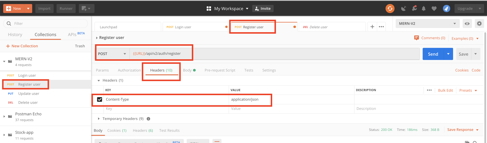
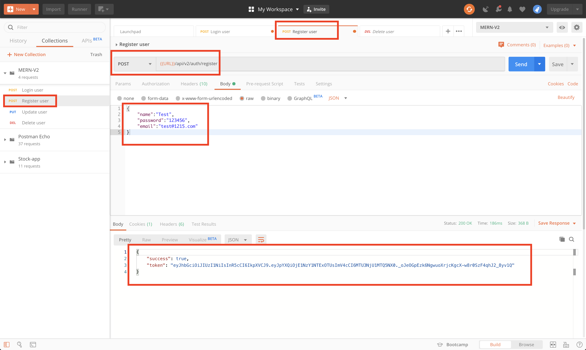

# MERN-Template-V2(part 3)

## `Section: Backend`(Refactor backend Authentication route)

### `Summary`: In this documentation, we refactor authentication route.

### `Check Dependencies`

(Back-end)
- express (part1)
- dotenv (part1)
- morgan (part1)
- mongoose (part2)
- colors (part2)
- jsonwebtoken (part2)
- bcryptjs (part2)
- cookie-parser(new)

(Dev-dependencies)
- nodemon (part1)

### `Brief Contents & codes position`
- 3.1 Add a new User model method, `Location:./models/User.js`
- 3.2 Add login method, `Location:./controllers/auth.js`
- 3.3 Bring login method to route, `Location:./apis/auth.js`

- 3.4 Create a helper function to create token and store it in cookie.(4 steps)
- 3.5 Create a Auth Protect Middleware (security)
- 3.6 Set up Role Authorization (security).

### `Step1: Add a new User model method,`
#### `(*3.1)Location:./models/User.js`

```js
const mongoose = require('mongoose');
const bcrypt = require('bcryptjs');
const jwt = require('jsonwebtoken')

const UserSchema = new mongoose.Schema({
    name: {
        type: String,
        required: [true, 'Please add a name'],
    },
    email: {
        type: String,
        required: [true, 'Please add an email'],
        unique: true,
        match: [
            /^\w+([\.-]?\w+)*@\w+([\.-]?\w+)*(\.\w{2,3})+$/,
            'Please add a valid email'
        ]
    },
    role: {
        type: String,
        enum: ['user', 'publisher'],
        default: 'user'
    },
    password: {
        type: String,
        required: [true, 'Please add a password'],
        minlength: 6,
        select: false,
    },
    resetPasswordToken: String,
    resetPasswordExpire: Date,
    createdAt: {
        type: Date,
        default: Date.now,
    }
});

// Encrypt password using bcrypt
UserSchema.pre('save', async function (next) {
    const salt = await bcrypt.genSalt(10);
    this.password = await bcrypt.hash(this.password, salt);
});

// Sign JWT and return
UserSchema.methods.getSignedJwtToken = () => {
    return jwt.sign({ id: this._id }, process.env.JWT_SECRET, {
        expiresIn: process.env.JWT_EXPIRE
    })
}

// Match user entered password to hashed password in database
UserSchema.methods.matchPassword = async function (enteredPassword) {
    const result = await bcrypt.compare(enteredPassword, this.password);
    return result;
}

module.exports = mongoose.model('User', UserSchema);
```

### `Step2: Add login method`
#### `Location:./controllers/auth.js`

```js
// @desc       Login user
// @route      Post /api/v2/auth/register
// @access     Public
exports.login = async (req, res, next) => {
    const { email, password } = req.body;

    //Validate email & password
    // if (!email || !password) {
    //     return next(new ErrorResponse('Please provide an email and password', 400))
    // }

    //Check for user
    const user = await User.findOne({ email }).select('+password');

    // if (!user) {
    //     return next(new ErrorResponse('Invalid credentials', 401))
    // }

    //Check if password matched
    const isMatch = await user.matchPassword(password);

    // if (!isMatch) {
    //     return next(new ErrorResponse('Invalid credentials', 401))
    // }

    //Create token
    const token = user.getSignedJwtToken();

    res.status(200).json({
        success:true,
        token: token
    })
}
```
### `Comments:`
- 注释部分包含了下一part的错误控制内容。
- 实现：输入存在的用户和正确的密码，返回token。

### `Step3: Bring login method to route`
#### `(*3.2)Location:./apis/auth.js`

```js
const router = require('express').Router();
const {
    register,
    login
} = require('../controllers/auth')

router.post('/register', register);
router.post('/login', login)

module.exports = router;
```

### `Comments:`
- Import the colors library.
```js
const colors = require('colors');
```

### `Step4: Create a helper function to create token and store it in cookie`

#### A. Add new package.
- Install package.
```
$ npm i cookie-parser
```
#### `Location:./server.js`
```js
const cookieParser = require('cookie-parser');
app.use(cookieParser());
```
#### B.Add new environment variable
#### `Location:./config/config.env`

```js
NODE_ENV=development
PORT=5000

MONGO_URI=mongodb+srv:...

JWT_SECRET=...
JWT_EXPIRE=...
JWT_COOKIE_EXPIRE=...
```

#### C.Create a custom function(`本章重点`)
#### `Location:./controllers/auth.js`

```js
const sendTokenResponse = (user, statusCode, res) => {
    const token = user.getSignedJwtToken();
    const options = {
        expires: new Date(Date.now() + process.env.JWT_COOKIE_EXPIRE * 24 * 60 * 60 * 1000),
        httpOnly: true
    }

    //For production
    if (process.env.NODE_ENV === 'production') {
        options.secure = true;
    }

    res
        .status(statusCode)
        .cookie('token', token, options)
        .json({
            success: true,
            token: token
        });
}
```

#### D.Refactor register and login methods
#### `Location:./controllers/auth.js`
```js
const User = require('../models/User');

const sendTokenResponse = (user, statusCode, res) => {
    const token = user.getSignedJwtToken();
    const options = {
        expires: new Date(Date.now() + process.env.JWT_COOKIE_EXPIRE * 24 * 60 * 60 * 1000),
        httpOnly: true
    }

    //For production
    if (process.env.NODE_ENV === 'production') {
        options.secure = true;
    }

    res
        .status(statusCode)
        .cookie('token', token, options)
        .json({
            success: true,
            token: token
        });
}

// @desc       Register user
// @route      Post /api/v2/auth/register
// @access     Public
exports.register = async (req, res, next) => {
    const { name, email, password, role } = req.body;

    const user = await User.create({
        name,
        email,
        password,
        role
    });

    sendTokenResponse(user, 200, res)
}

// @desc       Login user
// @route      Post /api/v2/auth/register
// @access     Public
exports.login = async (req, res, next) => {
    const { email, password } = req.body;

    //Validate email & password
    // if (!email || !password) {
    //     return next(new ErrorResponse('Please provide an email and password', 400))
    // }

    //Check for user
    const user = await User.findOne({ email }).select('+password');

    // if (!user) {
    //     return next(new ErrorResponse('Invalid credentials', 401))
    // }

    //Check if password matched
    const isMatch = await user.matchPassword(password);

    // if (!isMatch) {
    //     return next(new ErrorResponse('Invalid credentials', 401))
    // }

    //Create token
    sendTokenResponse(user, 200, res)
}
```

### `Comments:`

- 中间第C部的函数 `sendTokenResponse` 是本说明的重点.

### `Step5: Create a Auth Protect Middleware(security)`
#### `Location:./controllers/auth.js`

### `Step6: Set up Role Authorization(security)`
#### `Location:./controllers/auth.js`


### Step6 : TEST

- Run command in bash.
```bash
$ npm run dev
```

- Set up header in Postman ----> content-type: Application/json.
<p align="center">

</p>

- Edit the raw body, send the request and get token back.
<p align="center">

</p>

- New user with encrypted password in Altas is created.
<p align="center">

</p>
