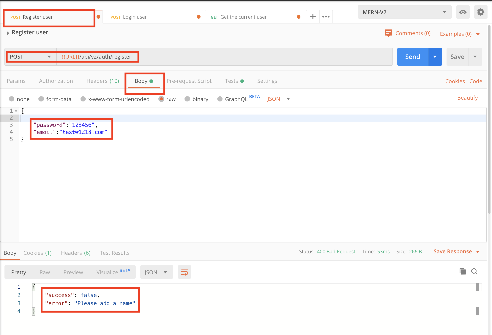
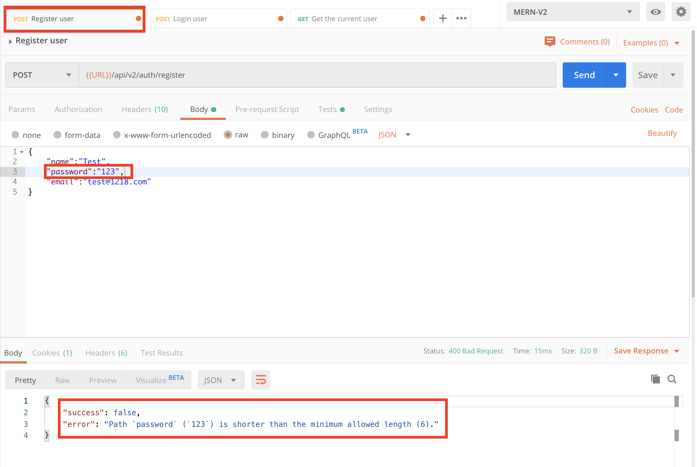
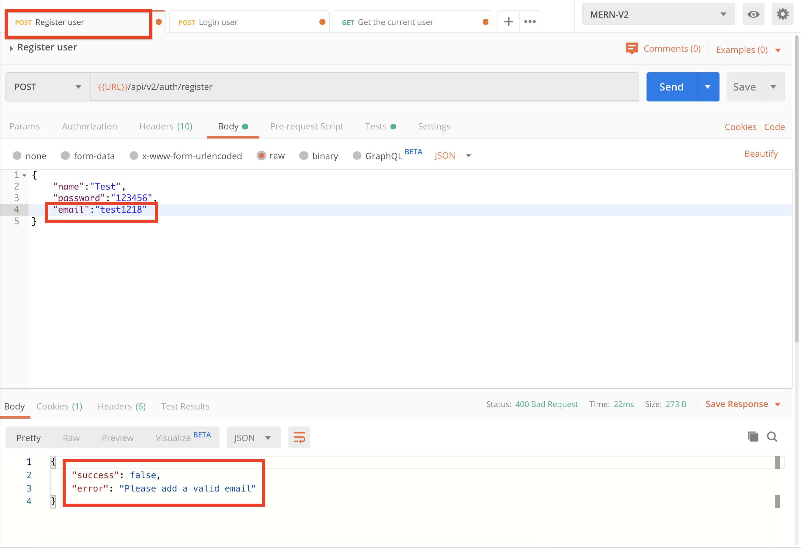
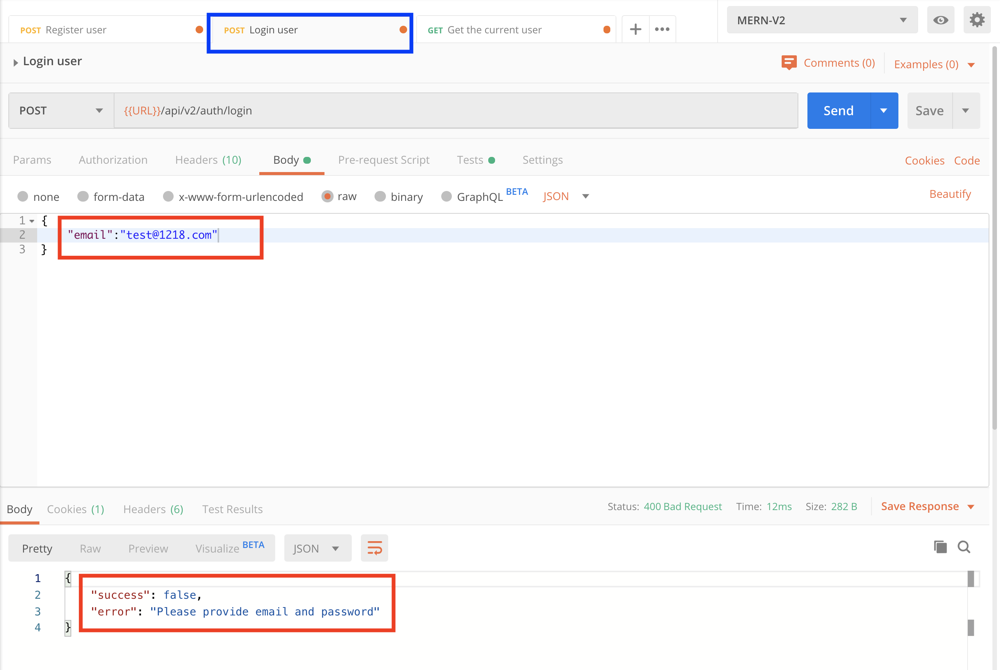
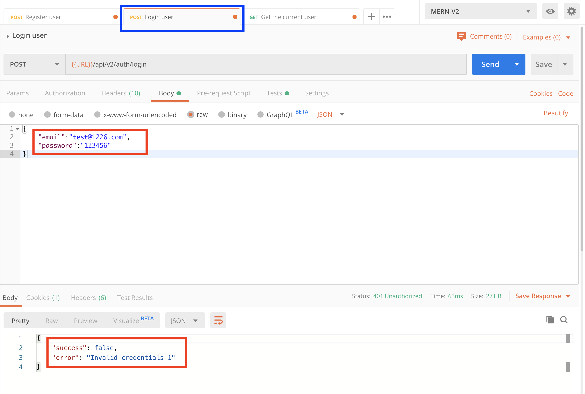
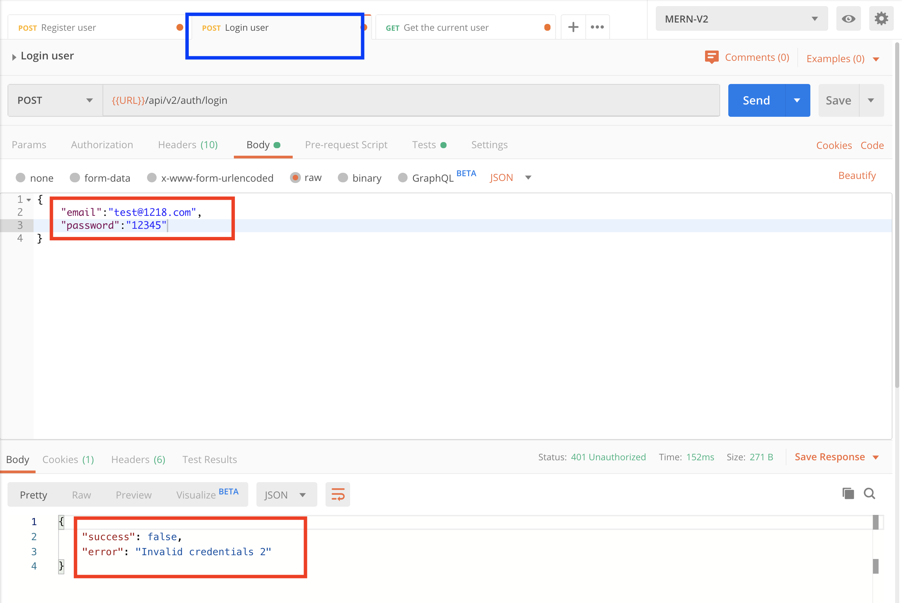
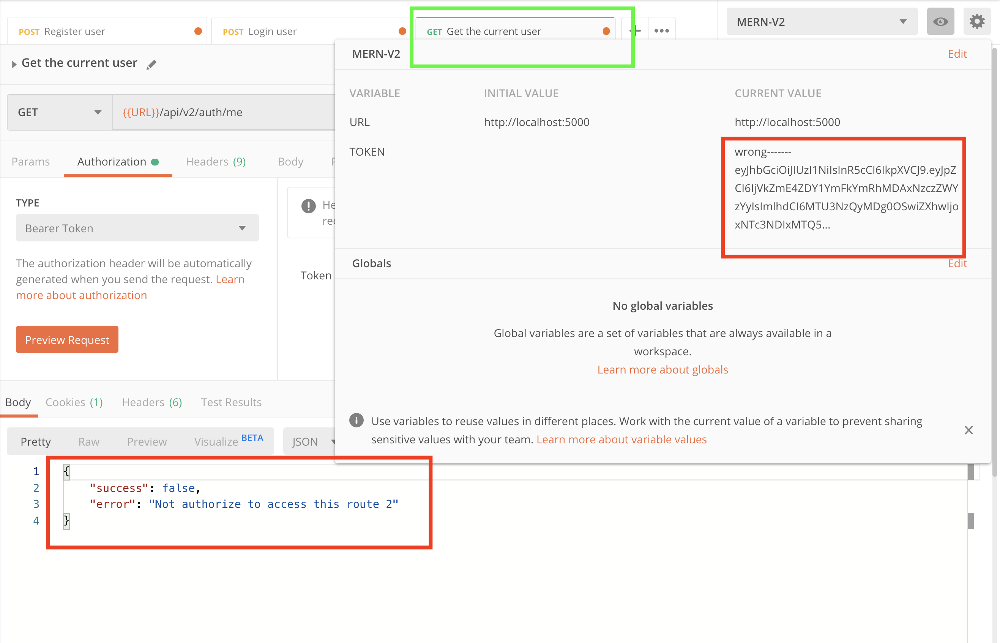

# MERN-Template-V2(part 4)

## `Section: Backend`(Refactor backend with Error handling)。

### `Summary`: In this documentation, we refactor backend with Error handling(处理显式与隐式错误控制). 

### `Check Dependencies`

(Back-end)
- express (part1)
- dotenv (part1)
- morgan (part1)
- mongoose (part2)
- colors (part2)
- jsonwebtoken (part2)
- bcryptjs (part2)
- cookie-parser (part3)

(Dev-dependencies)
- nodemon (part1)

### Designing path:
1. 做这个error handling middleware的目的在于更好的控制和分析错误，同时把错误信息整理成我们定制的格式以`json`的形式回传到客户端。
2. 在这里要先写一个定制error类，放在错误控制的中间件，中间件放在server.js代码中route之后，用来捕捉所有API request过程中抛出的错误。
3. 中间件的设置，主要是用来处理4大类错误信息，第一类是特定错误，第二类为可归类错误，第三类为未定义错误，第四类为其他错误（即服务器错误）。其中第三类的定义需要后面再定义；
4. 看以下代码
```js
//第一类：
    if (!email || !password) {
        return next(new ErrorResponse('Please provide email and password', 400));
    }
    if (!isMatch) {
        return next(new ErrorResponse('Invalid credentials 2', 401));
    }
```

```js
//第二类：
    // Mongoose Bad ObjectId
    if (err.name === 'CastError') {
        const message = `Resource not found with id of ${err.value}`;
        error = new ErrorResponse(message, 404); // redefine
    }

    // Mongoose Duplicate field key (重名，非unique)
    if (err.code === 11000) {
        const message = `Duplicate field value entered`;
        error = new ErrorResponse(message, 400); //redefine
    }

    // Mongoose Validation error
    if (err.name === 'ValidationError') {
        const message = Object.values(err.errors).map(val => val.message);
        error = new ErrorResponse(message, 400); // redefine
    }
```

```js
//第三类：
    let error = {};
    error.message = err.message;
    error.statusCode = err.statusCode;
```

```js
//第四类：
    error.message = 'Server Error';
    error.statusCode = 500;
```

### `Brief Contents & codes position.`
- 4.1 Create a custom error class, `Location:./utils/errorResponse.js`
- 4.2 Create a custom error middleware , `Location:./middleware/error.js`
- 4.3 Add errorHandler middleware to server, `Location:./server.js`

-------------------------------------------

- 4.4 Add error creators in route middlewares (protect & authorize).`Location:./middlesware/auth.js`
- 4.5 Add error creators in route methods.`Location:./controllers/auth.js`

### `Step1: Create a custom error class`
#### `(*4.1)Location:./utils/errorResponse.js`

```js
// 注意它这里继承的是Error类，这样就可以保持一致格式。
class ErrorResponse extends Error {
    constructor(message, statusCode) {
        super(message);
        this.statusCode = statusCode;
    }
}

module.exports = ErrorResponse;
```
### `Comments:`
- 这里代码的内容是生成一个error类，且继承本身的Error类的所有属性，同时增加一个新属性`statusCode`。
- 这个类的作用在于生成定制错误类。

### `Step2: Create a custom error middleware`
#### `（*4.2）Location:./middleware/error.js`

```js
const ErrorResponse = require('../utils/errorResponse');

const errorHandler = (err, req, res, next) => {
    console.log(err);
    // copy the err object,if the error is from catch, redefine it in the if statement,
    // if the error is not from catch, it only has two property, one is message, one is statusCode
    let error = {};

    error.message = err.message; //necessary? Yes, when the error is from errorResponse（第一类）.
    error.statusCode = err.statusCode;

    // Mongoose Bad ObjectId
    if (err.name === 'CastError') {
        const message = `Resource not found with id of ${err.value}`;
        error = new ErrorResponse(message, 404); // redefine
    }

    // Mongoose Duplicate field key (重名，非unique)
    if (err.code === 11000) {
        const message = `Duplicate field value entered`;
        error = new ErrorResponse(message, 400); //redefine
    }

    // Mongoose Validation error
    if (err.name === 'ValidatorError') {
        const message = Object.values(err.errors).map(val => val.message);
        error = new ErrorResponse(message, 400); // redefine
    }

    res.status(error.statusCode || 500).json({
        success: false,
        error: error.message || 'Server Error'
    });
}

module.exports = errorHandler;
```

### `Comments:`
- 这个中间件设置的很巧妙，先看这3句代码预处理第一类错误（特定已知错误），还有第三类错误（未定义错误）的预处理：

```js
//在这里，中间件的对第一类错误的假定预处理，如果是第一类错误，直接赋值而不用进入之后的if语句
let error = { ...err };
error.message = err.message;
error.statusCode = err.statusCode;
```

- 之后的语句是处理第二类错误（已知可归类错误），在这里特指从Mongo model中监测到的错误，代码中实现了如果碰到合适的第三类错误可进行重定义为第二类的功能。
- 最后处理的是第四类错误。
- 在这里，对第三类错误还是有好奇成分在的，作为漏网之鱼，第三类错误是否有错误代码（`statusCode`）呢（这里应该查看错误类的结构，初步看到是没有的），如果没有，经过层层过滤，到最后可能剩下的第三类是不是错误代码被标为500？（在这里需要重新考究是不是设计思路问题）。


### `Step3: Add errorHandler middleware to server.`
#### `（*4.3）Location:./server.js`

```js
//Load env vars
const dotenv = require('dotenv');
dotenv.config({ path: './config/config.env' });
const PORT = process.env.PORT || 5000;

//packages & middleware
const express = require('express');
const morgan = require('morgan');
const colors = require('colors');
const cookieParser = require('cookie-parser');
const connectDB = require('./config/db');
const errorHandler = require('./middleware/error');

//Server
const app = express();

//DB
connectDB();

//Middlewares
app.use(express.json());
app.use(cookieParser());

if (process.env.NODE_ENV === 'development') {
    app.use(morgan('dev'));
}

/*
Routes here!!
*/
app.use('/api/v2', require('./apis'));

//Error handler middleware
app.use(errorHandler);

const server = app.listen(PORT, () => console.log(`server is listening on port ${PORT} ===>`));

//Handle unhandled promise rejection
process.on('unhandledRejection', (err, promise) => {
    console.log(`Error: ${err.message}`.red.bold);
    server.close(() => process.exit(1));
})
```

### `Comments:`
- 注意中间件的位置，必须在route之后，这样就可以处理在前面route中产生的error都可以经过不断的next后在这个middleware中接住：
```js
/*
Routes here!!
*/
app.use('/api/v2', require('./apis'));

//Error handler middleware
app.use(errorHandler);
```

### `Step4: Add error creators in middlewares.`
#### `(*4.4)Location:./middleware/auth.js`

```js
const User = require('../models/User');
const jwt = require('jsonwebtoken');
const ErrorResponse = require('../utils/errorResponse');


//Check if the token is valid
exports.protect = async (req, res, next) => {
  let token;
  if (req.headers.authorization && req.headers.authorization.startsWith('Bearer')) {
    token = req.headers.authorization.split(' ')[1];
  }

  // else if (req.cookies.token) {
  //   token = req.cookies.token
  // }

  // Make sure token exists
  if (!token) {
    return next(new ErrorResponse('Not authorize to access this route (no token)', 401));
  }

  try {
    const decoded = jwt.verify(token, process.env.JWT_SECRET);
    req.user = await User.findById(decoded.id);
    next(); //route middleware

  } catch (err) {
    return next(new ErrorResponse('Not authorize to access this route (invalid token)', 401)); // Catch error and stop.
  }
}

//Grand access to specific roles
exports.authorize = (...roles) => {
  return (req, res, next) => {
    if (!roles.includes(req.user.role)) {
      return next(new ErrorResponse(`User role ${req.user.role} is not authorized to access this route`, 403));
    }
    next();
  }
}
```
### `Comments:`

- 在middleware中增加的error creator一般都是第一类错误，即特定已知错误.
- 写第一类错误的代码要注意格式，除了`new`关键词以外，还要注意因为本身是middleware而要添加的`next`关键词，当然还有打断流程关键词`return`,如：
```js
    return next(new ErrorResponse('Not authorize to access this route 1', 401));
```

### `Step5: Add error creators in route methods.`
#### `(*4.5)Location:./controllers/auth.js`

```js
const User = require('../models/User');
const ErrorResponse = require('../utils/errorResponse');

const sendTokenResponse = (user, statusCode, res) => {
    const token = user.getSignedJwtToken();
    const options = {
        expires: new Date(Date.now() + process.env.JWT_COOKIE_EXPIRE * 24 * 60 * 60 * 1000),
        httpOnly: true
    }

    //For production
    if (process.env.NODE_ENV === 'production') {
        // for https
        options.secure = true;
    }

    res
        .status(statusCode)
        .cookie('token', token, options)
        .json({
            success: true,
            token: token
        });
}

// @desc       Register user
// @route      Post /api/v2/auth/register
// @access     Public
exports.register = async (req, res, next) => {
    try {
        const { name, email, password, role } = req.body;

        const user = await User.create({
            name,
            email,
            password,
            role
        });
        sendTokenResponse(user, 200, res);

    } catch (err) {
        next(err);
    }
};

// @desc       Login user
// @route      Post /api/v2/auth/register
// @access     Public
exports.login = async (req, res, next) => {
    try {
        // Validate email & password
        const { email, password } = req.body;
        if (!email || !password) {
            return next(new ErrorResponse('Please provide email and password', 400));
        }

        //Check for user
        const user = await User.findOne({ email }).select('+password');
        if (!user) {
            return next(new ErrorResponse('Invalid credentials (invalid email)', 401));
        }

        //Check if password matches (model method)
        const isMatch = await user.matchPassword(password);
        if (!isMatch) {
            return next(new ErrorResponse('Invalid credentials (invalid password)', 401));
        }
        //Create token
        sendTokenResponse(user, 200, res);

    } catch (err) {
        next(err);
    }
};

// @desc       Get current logged in user
// @route      Post /api/v2/auth/me
// @access     Private
exports.getMe = async (req, res, next) => {
    try {
        const user = await User.findById(req.user.id);
        res.status(200).json({
            success: true,
            data: user
        });

    } catch (err) {
        next(err);
    }
};
```

### `Comments:`

- 这里写的是route 的error creator，跟milldeware中最大的不同是这里还需要包含第二类错误的代码。
- route middleware一般都只处理第一类错误（特定已知错误）。
- 这里的第一类错误都是特指自定义的已知错误，如
```js
        if (!isMatch) {
            return next(new ErrorResponse('Invalid credentials 2', 401));
        }
```
- 这里的第二类错误都在catch中处理，也就是来自`await`过程的错误，如
```js
catch (err) {
        next(err);
    }
```

### Step6 : TEST

- Register without some required field.
<p align="center">

</p>

- Register with short password.
<p align="center">

</p>

- Register with wrong format email.
<p align="center">

</p>

- Register with duplicate email.
<p align="center">

</p>

- Login without some required field.
<p align="center">

</p>

- Login with email which is not existed in database.
<p align="center">

</p>

- Login with a invalid password.
<p align="center">

</p>

- Send a request without token.
<p align="center">

</p>

- Send request with invalid token.
<p align="center">

</p>


