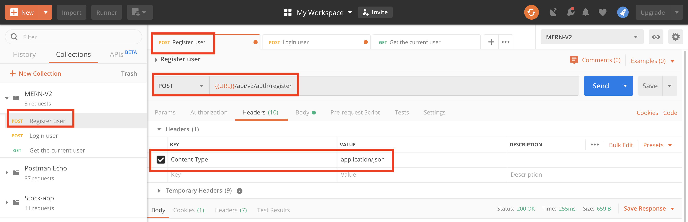

# MERN-Template-V2(part 4)

## `Section: Backend`(Refactor backend with Error handling)。

### `Summary`: In this documentation, we refactor backend with Error handling(处理显式与隐式错误控制). 

### `Check Dependencies`

(Back-end)
- express (part1)
- dotenv (part1)
- morgan (part1)
- mongoose (part2)
- colors (part2)
- jsonwebtoken (part2)
- bcryptjs (part2)
- cookie-parser (part3)

(Dev-dependencies)
- nodemon (part1)

### Designing path:
1. 在这里实际上是要写一个错误控制的中间件，放在server.js代码中route之后，用来捕捉所有API request过程中抛出的错误。
2. 中间件的设置，主要是用来处理4大类错误信息，第一类是特定错误，第二类为可归类错误，第三类为未定义错误，第四类为其他错误（即服务器错误）。其中第三类的定义需要后面再定义；
3. 看以下代码
```js
//第一类：
    if (!email || !password) {
        return next(new ErrorResponse('Please provide email and password', 400));
    }
    if (!isMatch) {
        return next(new ErrorResponse('Invalid credentials 2', 401));
    }
```

```js
//第二类：
    // Mongoose Bad ObjectId
    if (err.name === 'CastError') {
        const message = `Resource not found with id of ${err.value}`;
        error = new ErrorResponse(message, 404); // redefine
    }

    // Mongoose Duplicate field key (重名，非unique)
    if (err.code === 11000) {
        const message = `Duplicate field value entered`;
        error = new ErrorResponse(message, 400); //redefine
    }

    // Mongoose Validation error
    if (err.name === 'ValidationError') {
        const message = Object.values(err.errors).map(val => val.message);
        error = new ErrorResponse(message, 400); // redefine
    }
```

```js
//第三类：
    let error = {};
    error.message = err.message;
    error.statusCode = err.statusCode;
```

```js
//第四类：
    error.message = 'Server Error';
    error.statusCode = 500;
```

### `Brief Contents & codes position.`
- 4.1 Create a custom error class, `Location:./utils/errorResponse.js`
- 4.2 Create a custom error middleware , `Location:./middleware/error.js`
- 4.3 Add errorHandler middleware to server, `Location:./server.js`

- 4.4 Create a helper function to generate token, store it in cookie, and return it(4 steps)
- 4.5 Create Auth security Middleware (protect) and route middleware (getMe).
- 4.6 Create a Role Authorization security Middleware (authorize).

### `Step1: Create a custom error class`
#### `(*4.1)Location:./utils/errorResponse.js`

```js
// 注意它这里继承的是Error类，这样就可以保持一致格式。
class ErrorResponse extends Error {
    constructor(message, statusCode) {
        super(message);
        this.statusCode = statusCode;
    }
}

module.exports = ErrorResponse;
```
### `Comments:`
- 这里代码的内容是生成一个error类，且继承本身的Error类的所有属性，同时增加一个新属性`statusCode`。
- 这个类的作用在于生成定制错误类。

### `Step2: Create a custom error middleware`
#### `Location:./middleware/error.js`

```js
const ErrorResponse = require('../utils/errorResponse');

const errorHandler = (err, req, res, next) => {
    console.log(err);
    // copy the err object,if the error is from catch, redefine it in the if statement,
    // if the error is not from catch, it only has two property, one is message, one is statusCode
    let error = {};

    error.message = err.message; //necessary? Yes, when the error is from errorResponse（第一类）.
    error.statusCode = err.statusCode;

    // Mongoose Bad ObjectId
    if (err.name === 'CastError') {
        const message = `Resource not found with id of ${err.value}`;
        error = new ErrorResponse(message, 404); // redefine
    }

    // Mongoose Duplicate field key (重名，非unique)
    if (err.code === 11000) {
        const message = `Duplicate field value entered`;
        error = new ErrorResponse(message, 400); //redefine
    }

    // Mongoose Validation error
    if (err.name === 'ValidatorError') {
        const message = Object.values(err.errors).map(val => val.message);
        error = new ErrorResponse(message, 400); // redefine
    }

    res.status(error.statusCode || 500).json({
        success: false,
        error: error.message || 'Server Error'
    });
}

module.exports = errorHandler;
```

### `Comments:`
- 这个中间件设置的很巧妙，先看这3句代码预处理第一类错误（特定已知错误），还有第三类错误（未定义错误）的预处理：

```js
//在这里，中间件的对第一类错误的假定预处理，如果是第一类错误，直接赋值而不用进入之后的if语句
let error = { ...err };
error.message = err.message;
error.statusCode = err.statusCode;
```

- 之后的语句是处理第二类错误（已知可归类错误），在这里特指从Mongo model中监测到的错误，代码中实现了如果碰到合适的第三类错误可进行重定义为第二类的功能。
- 最后处理的是第四类错误。
- 在这里，对第三类错误还是有好奇成分在的，作为漏网之鱼，第三类错误是否有错误代码（`statusCode`）呢（这里应该查看错误类的结构，初步看到是没有的），如果没有，经过层层过滤，到最后可能剩下的第三类是不是错误代码被标为500？（在这里需要重新考究是不是设计思路问题）。


### `Step3: Add errorHandler middleware to server.`
#### `Location:./server.js`

```js
//Load env vars
const dotenv = require('dotenv');
dotenv.config({ path: './config/config.env' });
const PORT = process.env.PORT || 5000;

//packages & middleware
const express = require('express');
const morgan = require('morgan');
const colors = require('colors');
const cookieParser = require('cookie-parser');
const connectDB = require('./config/db');
const errorHandler = require('./middleware/error');

//Server
const app = express();

//DB
connectDB();

//Middlewares
app.use(express.json());
app.use(cookieParser());

if (process.env.NODE_ENV === 'development') {
    app.use(morgan('dev'));
}

/*
Routes here!!
*/
app.use('/api/v2', require('./apis'));

//Error handler middleware
app.use(errorHandler);

const server = app.listen(PORT, () => console.log(`server is listening on port ${PORT} ===>`));

//Handle unhandled promise rejection
process.on('unhandledRejection', (err, promise) => {
    console.log(`Error: ${err.message}`.red.bold);
    server.close(() => process.exit(1));
})
```

### `Comments:`
- 注意中间件的位置，必须在route之后：
```js
/*
Routes here!!
*/
app.use('/api/v2', require('./apis'));

//Error handler middleware
app.use(errorHandler);
```


### `Step4: Create a helper function to generate token, store it in cookie, and return it.`

#### A. Add new package.
- Install package.
```
$ npm i cookie-parser
```

- Import it.
#### `(*3.2)Location:./server.js`
```js
//Load env vars
const dotenv = require('dotenv');
dotenv.config({ path: './config/config.env' });
const PORT = process.env.PORT || 5000;

//packages
const express = require('express');
const morgan = require('morgan');
const colors = require('colors');
const cookieParser = require('cookie-parser');
const connectDB = require('./config/db');

//Server
const app = express();

//DB
connectDB();

//Middlewares
app.use(express.json());
app.use(cookieParser());

if (process.env.NODE_ENV === 'development') {
    app.use(morgan('dev'));
}

/*
Routes here!!
*/
app.use('/api/v2', require('./apis'));

const server = app.listen(PORT, () => console.log(`server is listening on port ${PORT} ===>`));

//Handle unhandled promise rejection
process.on('unhandledRejection', (err, promise) => {
    console.log(`Error: ${err.message}`.red.bold);
    server.close(() => process.exit(1));
})

```
- 加入以下代码：
```diff
+ const cookieParser = require('cookie-parser');
+ app.use(cookieParser());
```
- 备注：加入了新的library后，可以实现把生成的token储存在cookies中。

#### B.Add new environment variable
#### `(*3.3)Location:./config/config.env`

```js
NODE_ENV=development
PORT=5000

MONGO_URI=mongodb+srv:...

JWT_SECRET=...
JWT_EXPIRE=...
JWT_COOKIE_EXPIRE=...
```

#### C.Create a custom helper function(`本章重点：生成token，生成cookie，返回token`)
#### `Location:./controllers/auth.js`

```js
const sendTokenResponse = (user, statusCode, res) => {
    const token = user.getSignedJwtToken();
    const options = {
        expires: new Date(Date.now() + process.env.JWT_COOKIE_EXPIRE * 24 * 60 * 60 * 1000),
        httpOnly: true
    }

    //For production
    if (process.env.NODE_ENV === 'production') {
        options.secure = true;
    }

    res
        .status(statusCode)
        .cookie('token', token, options) // cookie-parser
        .json({
            success: true,
            token: token
        });
}
```

#### D.Refactor register and login methods
#### `Location:./controllers/auth.js`

```js
//See PartB step5
```

### `Comments:`

- 中间第C步的函数 `sendTokenResponse` 是本说明的重点.

### `Step5: Create Auth security Middleware (protect) and route middleware (getMe).`

#### - 把这个route middleware放在目标route中，作用就是解析token得到id，验证id的有效性，有效就放行到下一个中间件，没效就报错。

#### A. Create a middleware method
#### `Location:./middleware/auth.js`

```js
const User = require('../models/User');
const jwt = require('jsonwebtoken');

exports.protect = async (req, res, next) => {
  let token;
  if (req.headers.authorization && req.headers.authorization.startsWith('Bearer')) {
    token = req.headers.authorization.split(' ')[1];
  }

  // else if (req.cookies.token) {
  //   token = req.cookies.token
  // }

  // Make sure token exists
  // if (!token) {
  //   return res.status(400).json({ success: false })
  // }

  try {
    const decoded = jwt.verify(token, process.env.JWT_SECRET);
    req.user = await User.findById(decoded.id);
    next();
  } catch (err) {
    return res.status(400).json({ success: false })
  }
}
```

#### B. Create a new route method (middleware) （getMe）
#### `(*3.4)Location:./controllers/auth.js`

```js
const User = require('../models/User');

const sendTokenResponse = (user, statusCode, res) => {
    const token = user.getSignedJwtToken();
    const options = {
        expires: new Date(Date.now() + process.env.JWT_COOKIE_EXPIRE * 24 * 60 * 60 * 1000),
        httpOnly: true
    }

    //For production
    if (process.env.NODE_ENV === 'production') {
        //https
        options.secure = true;
    }

    res
        .status(statusCode)
        .cookie('token', token, options) // cookie-parser
        .json({
            success: true,
            token: token
        });
}

// @desc       Register user
// @route      Post /api/v2/auth/register
// @access     Public
exports.register = async (req, res, next) => {
    const { name, email, password, role } = req.body;

    const user = await User.create({
        name,
        email,
        password,
        role
    });

    sendTokenResponse(user, 200, res)
}

// @desc       Login user
// @route      Post /api/v2/auth/register
// @access     Public
exports.login = async (req, res, next) => {
    const { email, password } = req.body;

    //Validate email & password
    // if (!email || !password) {
    //     return next(new ErrorResponse('Please provide an email and password', 400))
    // }

    //Check for user
    const user = await User.findOne({ email }).select('+password');

    // if (!user) {
    //     return next(new ErrorResponse('Invalid credentials', 401))
    // }

    //Check if password matched
    const isMatch = await user.matchPassword(password);

    // if (!isMatch) {
    //     return next(new ErrorResponse('Invalid credentials', 401))
    // }

    //Create token
    sendTokenResponse(user, 200, res)
}

// @desc       Get current logged in user
// @route      Post /api/v2/auth/me
// @access     Private
exports.getMe = async (req, res, next) => {
    const user = await User.findById(req.user.id);
    res.status(200).json({
        success: true,
        data: user
    });
}
```

#### C. Import the route method and middleware in route
#### `(*3.5)Location:./apis/auth.js`

```js
const router = require('express').Router();
const {
    register,
    login,
    getMe
} = require('../controllers/auth');

const { protect } = require('../middleware/auth')

router.post('/register', register);
router.post('/login', login);
router.get('/me', protect, getMe)

module.exports = router;
```

### `Comments:`

- 写middleware必须注意两点，第一点是经常需要改变req的内容，第二点是必须有`next()`.
- 在这个设计流程中，经过`protect`中间件的route都会在`req`中取得user全部的信息，而protect中间件的主要作用是在解析token，然后寻找对应的user，如果有user就改变req的内容，如果没有就报错。
- 这个部分很重要，主要练习如何创造和使用route middleware。

### `Step6: Create a Role Authorization security Middleware (authorize).`
#### `(*3.6) Location:./middleware/auth.js`

```js
const User = require('../models/User');
const jwt = require('jsonwebtoken');

//Check if the token is valid
exports.protect = async (req, res, next) => {
  let token;
  if (req.headers.authorization && req.headers.authorization.startsWith('Bearer')) {
    token = req.headers.authorization.split(' ')[1];
  }

  // else if (req.cookies.token) {
  //   token = req.cookies.token
  // }

  // Make sure token exists
  // if (!token) {
  //   return res.status(400).json({ success: false })
  // }

  try {
    const decoded = jwt.verify(token, process.env.JWT_SECRET);
    req.user = await User.findById(decoded.id);
    next();
  } catch (err) {
    return res.status(401).json({ success: false })
  }
}

//Grand access to specific roles
exports.authorize = (...roles) => {
  return (req, res, next) => {
    if (!roles.includes(req.user.role)) {
      return res.status(403).json({ success: false });
    }
    next();
  }
}
```
### `Comment:`
- 在目前而言，还没有一个route用到这个middleware，实际使用的方法是：
```js
router.get('/someRoute', protect, authorize, someFunction);
```
- 以上middleware的顺序说明了，`protect middleware`取得user的信息这个步骤是必要的，因为后面的`authorize middleware`会用到那里面的信息。

### `Summary:`
- 这个说明中改动的文件比较多，改动的代码也多，不能成为一个很好的说明，在这里暂时列出本说明中做出改变的文件，希望能起帮助。

1. `./models/User.js`(*3.1) - add schema, methods, hooks
2. `./config/config.env`(*3.2) -- add 1 new variable
3. `./server.js`(*3.3) -- import cookie-parser
4. `./controllers/auth.js`(*3.4) -- add getMe route middleware
5. `./middleware/auth.js`(*3.6) -- create 2 middlewares
6. `./apis/auth.js`(*3.5) -- import 1 new route middleware and 2 new middleware

### Step7 : TEST

- Run command in bash.
```bash
$ npm run dev
```

- Register a new user
<p align="center">

</p>

- ---------------------------------------
<p align="center">

</p>

- Login the new user with the email and password, then get a token back.
<p align="center">

</p>

- ---------------------------------------
<p align="center">

</p>

- In route '/api/v2/auth/me', use the token and protect middleware to get user's info.
<p align="center">

</p>
