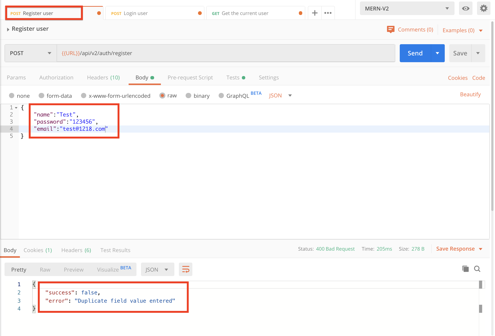
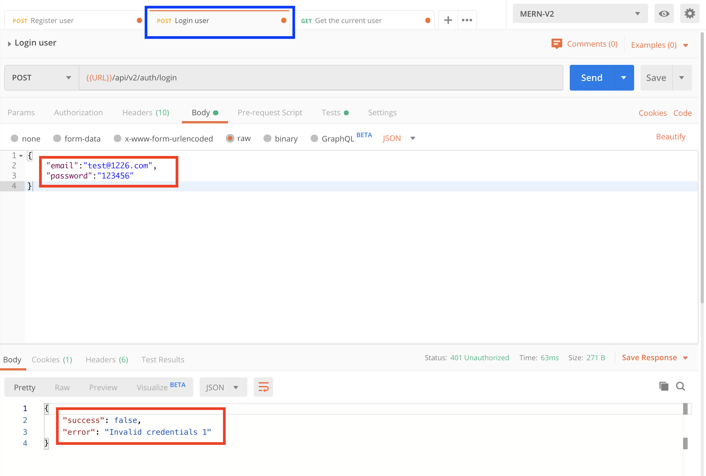

# MERN-Template-V2(part 5)

## `Section: Backend`(Add password API)。

### `Summary`: In this documentation, we add forget password api and reset password api. 

### `Check Dependencies`

(Back-end)
- express (part1)
- dotenv (part1)
- morgan (part1)
- mongoose (part2)
- colors (part2)
- jsonwebtoken (part2)
- bcryptjs (part2)
- cookie-parser (part3)
```diff
+ nodemailer(new)
+ crypto(new but built-in)
```

(Dev-dependencies)
- nodemon (part1)

### Designing path:
1. 在这里需要设计两个api，一个是forgotPassword API，另外一个是resetPassword API。
2. 设计思路，第一步在forgot middleware中生成一个reset token，第二步是整合reset token放在一个新的url中，而这个url是一个reset middleware的格式，第三部是依据url上的token在db中寻找并重置password。

### `Brief Contents & codes position.`
- 5.1 Create route middleware(forgotPassword), `Location:./controllers/auth.js`
- 5.2 Create some Mongo middleware in User model, `Location:./models/User.js`
- 5.3 Add the new middleware in route to build a api, `Location:./apis/auth`
-------------------------
- 5.4 Install nodemailer, create a account in mailtrap and set up some variable.`Location:./config/config.env`
- 5.5 Add a new method in utils.`Location:./utils/sendEmail.js`
- 5.6 Add the new method in `forgotPassword` route middleware.`Location:./controllers/auth.js`
--------------------------
- 5.7 Create route middleware(resetPassword), `Location:./controllers/auth.js`
- 5.8 Add the new middleware in route to build a api, `Location:./apis/auth`


### `Step1: Create a new route middleware(forgotPassword)`
#### `Location:./controllers/auth.js`

```js
// @desc       Forgot password
// @route      Post /api/v2/auth/forgotpassword
// @access     Public
exports.forgotPassword = async (req, res, next) => {
    try {
        const user = await User.findOne({ email: req.body.email });

        if (!user) {
            return next(new ErrorResponse(`There is no user with that email`, 404))
        }

        // Get reset token
        const resetToken = user.getResetPasswordToken();

        await user.save({ validateBeforeSave: false });

        res.status(200).json({
            success: true,
            data: user,
        })

    } catch (err) {
        next(err);
    }
};
```

### `Comments:`
- 这里用到了 getResetPasswordToken()，在step2中设定。

### `Step2: Create some Mongo middleware in User model`
#### `(*5.1)Location:./models/User.js`

```js
const mongoose = require('mongoose');
const bcrypt = require('bcryptjs');
const jwt = require('jsonwebtoken');
const crypto = require('crypto');

const UserSchema = new mongoose.Schema({
    name: {
        type: String,
        required: [true, 'Please add a name'],
    },
    email: {
        type: String,
        required: [true, 'Please add an email'],
        unique: true,
        match: [
            /^\w+([\.-]?\w+)*@\w+([\.-]?\w+)*(\.\w{2,3})+$/,
            'Please add a valid email'
        ]
    },
    role: {
        type: String,
        enum: ['user', 'publisher'],
        default: 'user'
    },
    password: {
        type: String,
        required: [true, 'Please add a password'],
        minlength: 6,
        select: false,
    },
    resetPasswordToken: String,
    resetPasswordExpire: Date,
    createdAt: {
        type: Date,
        default: Date.now,
    }
});

// Encrypt password using bcrypt. mongo middleware
UserSchema.pre('save', async function (next) {
    if (!this.isModified('password')) {
        next();
    }
    const salt = await bcrypt.genSalt(10);
    this.password = await bcrypt.hash(this.password, salt);
});

// Sign JWT and return
UserSchema.methods.getSignedJwtToken = function () {
    return jwt.sign({ id: this._id }, process.env.JWT_SECRET, {
        expiresIn: process.env.JWT_EXPIRE
    })
}

// Match user entered password to hashed password in database
UserSchema.methods.matchPassword = async function (enteredPassword) {
    const result = await bcrypt.compare(enteredPassword, this.password);
    return result;
}

//Generate and hash password token
UserSchema.methods.getResetPasswordToken = function () {
    // Generate token
    const resetToken = crypto.randomBytes(20).toString('hex');

    // Hash token and set to resetPasswordToken field
    this.resetPasswordToken = crypto
        .createHash('sha256')
        .update(resetToken)
        .digest('hex');

    // Set expire
    this.resetPasswordExpire = Date.now() + 10 * 60 * 1000;

    return resetToken;
}

module.exports = mongoose.model('User', UserSchema);
```

### `Comments:`
- 在这里，主要改动了3个部分：
```js
const crypto = require('crypto');
```
```js
//Generate and hash password token
UserSchema.methods.getResetPasswordToken = function () {
    // Generate token
    const resetToken = crypto.randomBytes(20).toString('hex');

    // Hash token and set to resetPasswordToken field
    this.resetPasswordToken = crypto
        .createHash('sha256')
        .update(resetToken)
        .digest('hex');

    // Set expire
    this.resetPasswordExpire = Date.now() + 10 * 60 * 1000;

    return resetToken;
}
```
```js
// Encrypt password using bcrypt. mongo middleware
UserSchema.pre('save', async function (next) {
    if (!this.isModified('password')) {
        next();
    }
    const salt = await bcrypt.genSalt(10);
    this.password = await bcrypt.hash(this.password, salt);
});
```

- 第一步是引进一个built-in的crypto，然后在第二步中使用。
- 第二步的意思是创造一个model middleware，通过crypto把resetPasswordToken和resetPasswordExpire赋值。
- 第三步是更改model的hook，因为之前的设定是读取user时是不读取password的（相关代码如下），在这种情况下是无法按照原代码进行保存用户的，在这里使用一个if判定，如果password没有发现更改就跳过加密password的代码直接保存修改过的用户信息。
```js
    password: {
        type: String,
        required: [true, 'Please add a password'],
        minlength: 6,
        select: false,//正常不读取
    },
```
- 在这里，对middleware进行一个小结，目前做过的有dependency middleware（morgan，cookie等），有route middleware（其中有validate middleware，endpoint middleware，error handling middleware），还有现在在做的Mongo model middleware一共三大类。

### `Step3: Add the new endpoint middleware in route to build a api.`
#### `Location:./apis/auth.js`

```js
const router = require('express').Router();
const {
    register,
    login,
    getMe,
    forgotPassword,
} = require('../controllers/auth');

const { protect } = require('../middleware/auth')

router.post('/register', register);
router.post('/login', login);
router.get('/me', protect, getMe);
router.post('/forgotpassword', forgotPassword);

module.exports = router;
```

### `Comments:`
- 到目前为止，我们实现了一个新api，当我们设定header：constent-type，value：applic/json后，在raw body提供email后，发出post request就可以发动这个api。
```js
router.post('/forgotpassword', forgotPassword);
```
- 成功之后得到对应用户在db中的信息有两个地方被修改`resetPasswordToken和resetPasswordExpire`。

### `Step4: Add error creators in middlewares.`
#### `(*4.4)Location:./middleware/auth.js`

```js
const User = require('../models/User');
const jwt = require('jsonwebtoken');
const ErrorResponse = require('../utils/errorResponse');


//Check if the token is valid
exports.protect = async (req, res, next) => {
  let token;
  if (req.headers.authorization && req.headers.authorization.startsWith('Bearer')) {
    token = req.headers.authorization.split(' ')[1];
  }

  // else if (req.cookies.token) {
  //   token = req.cookies.token
  // }

  // Make sure token exists
  if (!token) {
    return next(new ErrorResponse('Not authorize to access this route (no token)', 401));
  }

  try {
    const decoded = jwt.verify(token, process.env.JWT_SECRET);
    req.user = await User.findById(decoded.id);
    next(); //route middleware

  } catch (err) {
    return next(new ErrorResponse('Not authorize to access this route (invalid token)', 401)); // Catch error and stop.
  }
}

//Grand access to specific roles
exports.authorize = (...roles) => {
  return (req, res, next) => {
    if (!roles.includes(req.user.role)) {
      return next(new ErrorResponse(`User role ${req.user.role} is not authorized to access this route`, 403));
    }
    next();
  }
}
```
### `Comments:`

- 在middleware中增加的error creator一般都是第一类错误，即特定已知错误.
- 写第一类错误的代码要注意格式，除了`new`关键词以外，还要注意因为本身是middleware而要添加的`next`关键词，当然还有打断流程关键词`return`,如：
```js
    return next(new ErrorResponse('Not authorize to access this route 1', 401));
```

### `Step5: Add error creators in route methods.`
#### `(*4.5)Location:./controllers/auth.js`

```js
const User = require('../models/User');
const ErrorResponse = require('../utils/errorResponse');

const sendTokenResponse = (user, statusCode, res) => {
    const token = user.getSignedJwtToken();
    const options = {
        expires: new Date(Date.now() + process.env.JWT_COOKIE_EXPIRE * 24 * 60 * 60 * 1000),
        httpOnly: true
    }

    //For production
    if (process.env.NODE_ENV === 'production') {
        // for https
        options.secure = true;
    }

    res
        .status(statusCode)
        .cookie('token', token, options)
        .json({
            success: true,
            token: token
        });
}

// @desc       Register user
// @route      Post /api/v2/auth/register
// @access     Public
exports.register = async (req, res, next) => {
    try {
        const { name, email, password, role } = req.body;

        const user = await User.create({
            name,
            email,
            password,
            role
        });
        sendTokenResponse(user, 200, res);

    } catch (err) {
        next(err);
    }
};

// @desc       Login user
// @route      Post /api/v2/auth/register
// @access     Public
exports.login = async (req, res, next) => {
    try {
        // Validate email & password
        const { email, password } = req.body;
        if (!email || !password) {
            return next(new ErrorResponse('Please provide email and password', 400));
        }

        //Check for user
        const user = await User.findOne({ email }).select('+password');
        if (!user) {
            return next(new ErrorResponse('Invalid credentials (invalid email)', 401));
        }

        //Check if password matches (model method)
        const isMatch = await user.matchPassword(password);
        if (!isMatch) {
            return next(new ErrorResponse('Invalid credentials (invalid password)', 401));
        }
        //Create token
        sendTokenResponse(user, 200, res);

    } catch (err) {
        next(err);
    }
};

// @desc       Get current logged in user
// @route      Post /api/v2/auth/me
// @access     Private
exports.getMe = async (req, res, next) => {
    try {
        const user = await User.findById(req.user.id);
        res.status(200).json({
            success: true,
            data: user
        });

    } catch (err) {
        next(err);
    }
};
```

### `Comments:`

- 这里写的是route 的error creator，跟milldeware中最大的不同是这里还需要包含第二类错误的代码。
- route middleware一般都只处理第一类错误（特定已知错误）。
- 这里的第一类错误都是特指自定义的已知错误，如
```js
        if (!isMatch) {
            return next(new ErrorResponse('Invalid credentials 2', 401));
        }
```
- 这里的第二类错误都在catch中处理，也就是来自`await`过程的错误，如
```js
catch (err) {
        next(err);
    }
```

### Step6 : TEST

- Register without some required field.
<p align="center">

</p>

- Register with short password.
<p align="center">

</p>

- Register with wrong format email.
<p align="center">

</p>

- Register with duplicate email.
<p align="center">

</p>

- Login without some required field.
<p align="center">

</p>

- Login with email which is not existed in database.
<p align="center">

</p>

- Login with a invalid password.
<p align="center">

</p>

- Send a request without token.
<p align="center">

</p>

- Send request with invalid token.
<p align="center">

</p>