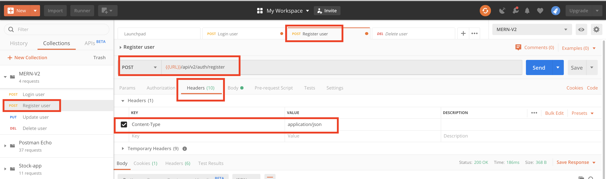
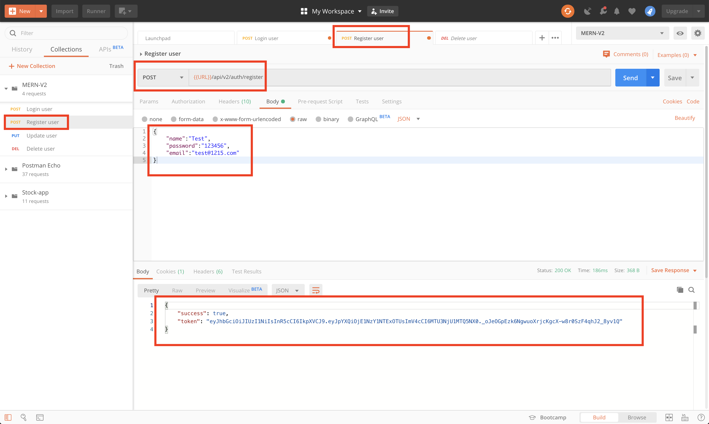
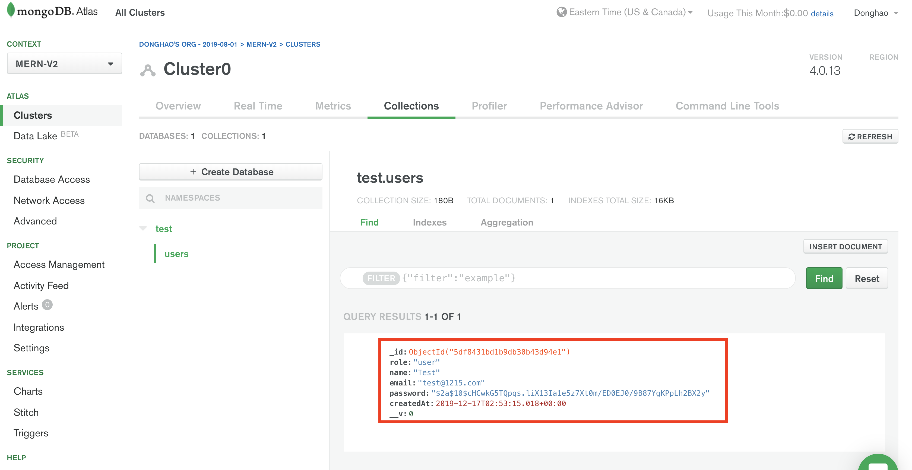

# MERN-Template-V2(part 2)

## `Section: Backend`(Refactor User model and register route)

### `Summary`: In this documentation, we refactor User model and register route.

### `Check Dependencies:`

(Back-end)
- express (part1)
- dotenv (part1)
- morgan (part1)
```diff
+ mongoose (new)
+ colors (new)
+ jsonwebtoken (new)
+ bcryptjs (new)
```

(Dev-dependencies)
- nodemon (part1)

### `Brief Contents & codes position`
- 2.1 Add Mongo and JWT variables in config.env, `Location:./config/config.env`
- 2.2 Change code in db configuration, `Location:./config/db.js`
- 2.3 Add DB code in server.js, `Location:./server.js`

- 2.4 Create new model for User, `Location:./models/User.js`
- 2.5 Refactor register route

### `Step1: Add new variables in config.env`
#### `(*2.1)Location:./config/config.env`

```js
NODE_ENV=development
PORT=5000

MONGO_URI=mongodb+srv:...
JWT_SECRET=...
JWT_EXPIRE=...
```

### `Step2: Change the code in db configuration`,
#### `(*2.2)Location:./config/db.js`

```js
const mongoose = require('mongoose');

const connectDB = async () => {
    const conn = await mongoose.connect(process.env.MONGO_URI, {
        useNewUrlParser: true,
        useUnifiedTopology: true,
        useCreateIndex: true,
        useFindAndModify: false,
    });
    console.log(`MongoDB connected: ${conn.connection.host}`.yellow.bold);
}

module.exports = connectDB;
```
### `Comments:`
- 在这里取消了使用try catch的方法进行报错控制，取消的报错控制放在server.js中。

### `Step3: Add DB code in server.js`
#### `(*2.3)Location:./server.js`

```js
//Load env vars
const dotenv = require('dotenv');
dotenv.config({ path: './config/config.env' });
const PORT = process.env.PORT || 5000;

//packages
const express = require('express');
const morgan = require('morgan');
const colors = require('colors');
const connectDB = require('./config/db');

//Apply
const app = express();

//DB
connectDB();

//Middlewares
app.use(express.json());

if (process.env.NODE_ENV === 'development') {
    app.use(morgan('dev'));
}

/*
Routes here!!
*/
app.use('/api/v2', require('./apis'));

const server = app.listen(PORT, () => console.log(`server is listening on port ${PORT} ===>`));

//Handle unhandled promise rejection

process.on('unhandledRejection', (err, promise) => {
    console.log(`Error: ${err.message}`.red.bold);
    server.close(() => process.exit(1));
})
```

### `Comments:`
- Import the colors library.
```js
const colors = require('colors');
```
- Import the DB and connect it.

```js
const connectDB = require('./config/db');
connectDB();
```

- Add body parser middleware.(`如果没有这一步，postman是不会接收到json的，这也是经常会遗忘的一步。`)

```js
app.use(express.json());
```
- Add `unhandledRejection` error handler. Instead put try catch in db.js（要注意这里的`unhandledRejection`是一个已定义变量）

```js
const server = app.listen(PORT, () => console.log(`server is listening on port ${PORT} ===>`));

process.on('unhandledRejection', (err, promise) => {
    console.log(`Error: ${err.message}`.red.bold);
    server.close(() => process.exit(1));
})
```

### `Step4: Refactor new User model`
#### `(*2.4)Location:./models/User.js`

```js
const mongoose = require('mongoose');
const bcrypt = require('bcryptjs');
const jwt = require('jsonwebtoken')

const UserSchema = new mongoose.Schema({
    name: {
        type: String,
        required: [true, 'Please add a name'],
    },
    email: {
        type: String,
        required: [true, 'Please add an email'],
        unique: true,
        match: [
            /^\w+([\.-]?\w+)*@\w+([\.-]?\w+)*(\.\w{2,3})+$/,
            'Please add a valid email'
        ]
    },
    role: {
        type: String,
        enum: ['user', 'publisher'],
        default: 'user'
    },
    password: {
        type: String,
        required: [true, 'Please add a password'],
        minlength: 6,
        select: false,
    },
    resetPasswordToken: String,
    resetPasswordExpire: Date,
    createdAt: {
        type: Date,
        default: Date.now,
    }
});

// Encrypt password using bcrypt
UserSchema.pre('save', async function (next) {
    const salt = await bcrypt.genSalt(10);
    this.password = await bcrypt.hash(this.password, salt);
});

// Sign JWT and return
UserSchema.methods.getSignedJwtToken = function(){
    return jwt.sign({ id: this._id }, process.env.JWT_SECRET, {
        expiresIn: process.env.JWT_EXPIRE
    })
}

module.exports = mongoose.model('User', UserSchema);
```

### `Comments:`

- 这个模型的特色在于，把validation放在model，加入了model method概念，还有hook概念，同时模型的定义使用到的属性也很有用，后续改英文.

```diff
+ 重要的事情讲三遍，在mongoDB的model中不能用 arrow function这是很难发现的bug，需要多留意。
- UserSchema.methods.getSignedJwtToken = () => {}
```

### `Step5: Create register route.(重新组织路由)`
#### `(*2.5)Location:./apis/index.js`

```js
const router = require('express').Router();

router.use('/auth', require('./auth'));

module.exports = router;
```

#### `(*2.6)Location:./apis/auth.js`

```js
const router = require('express').Router();
const {
    register,
} = require('../controllers/auth')

router.post('/register', register);

module.exports = router;
```

#### `(*2.7)Location:./controllers/auth.js`(注意这里把function拆开来跟V1不一样，相当于把function写成了Route Middleware，而所有的middleware都是有3参数的：req，res，next)。

#### 为什么没有用到next？ 因为后面会有一个集中处理的Error handling middleware。

```js
const User = require('../models/User');

// @desc       Register user
// @route      Post /api/v2/auth/register
// @access     Public
exports.register = async (req, res, next) => {
    const { name, email, password, role } = req.body;

    const user = await User.create({
        name,
        email,
        password,
        role
    });

    const token = user.getSignedJwtToken();

    res.status(200).json({
        success:true,
        token: token
    })
}
```

### Step6 : TEST

- Run command in bash.
```bash
$ npm run dev
```

- Set up header in Postman ----> content-type: Application/json.
<p align="center">

</p>

- Edit the raw body, send the request and get token back.
<p align="center">

</p>

- New user with encrypted password in Altas is created.
<p align="center">

</p>
