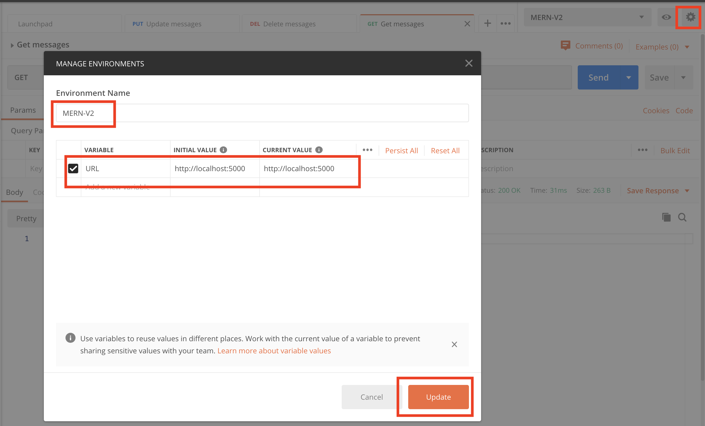
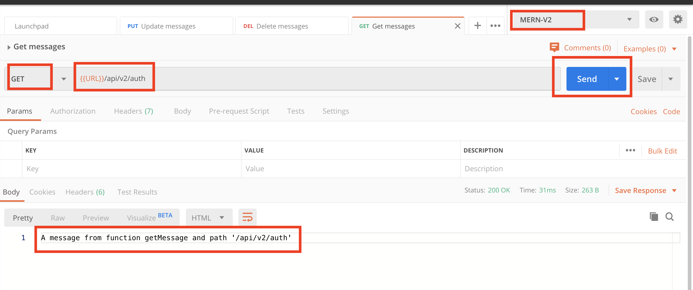

# MERN-Template-V2(part 2)

## `Section: Backend`(Refactor backend database and User model)

### `Summary`: In this documentation, we backend database and User model.

### `Check Dependencies`

(Back-end)
- express
- dotenv
- morgan
- mongoose
- colors
- jsonwebtoken
- bcryptjs

(Dev-dependencies)
- nodemon

### `Brief Contents & codes position`
- 2.1 Add a new variable in config.env, `Location:./config/config.env`
- 2.2 Change code in db configuration, `Location:./config/db.js`
- 2.3 Change some code in server.js, `Location:./server.js`

- 2.4 Create new model for User, `Location:./models/User.js`
- 2.5 Change the code in routes, `Location:./apis/auth.js`
- 2.6 Change the code in controllers, `Location:./controllers/auth.js`
- 2.7 Add a logger middleware (morgan), `Location:./server.js`

### `Step1: Add a new variable in config.env`
#### `(*2.1)Location:./config/config.env`

```js
NODE_ENV=development
PORT=5000

MONGO_URI =mongodb+srv:...
```

### `Step2: Change code in db configuration`,
#### `(*2.2)Location:./config/db.js`

```js
const mongoose = require('mongoose');

const connectDB = async () => {
    await mongoose.connect(process.env.MONGO_URI, {
        useNewUrlParser: true,
        useUnifiedTopology: true,
        useCreateIndex: true,
        useFindAndModify: false,
    });
    console.log('MongoDB connected...'.yellow.bold);
}

module.exports = connectDB;
```

### `Step3: Change some code in server.js`
#### `Location:./server.js`

```js
//Load env vars
const dotenv = require('dotenv');
dotenv.config({ path: './config/config.env' });
const PORT = process.env.PORT || 5000;

//packages
const express = require('express');
const morgan = require('morgan');
const colors = require('colors');
const connectDB = require('./config/db');

//Apply
const app = express();

//DB
connectDB();

//Middlewares
app.use(express.json());

if (process.env.NODE_ENV === 'development') {
    app.use(morgan('dev'));
}

/*
Routes here!!
*/
app.use('/api/v2', require('./apis'));

const server = app.listen(PORT, () => console.log(`server is listening on port ${PORT} ===>`));

//Handle unhandled promise rejection

process.on('unhandledRejection', (err, promise) => {
    console.log(`Error: ${err.message}`.red.bold);
    server.close(() => process.exit(1));
})

```

### `Comments:`

- Import the DB and connect it.
```js
const connectDB = require('./config/db');
connectDB();
```

- Add body parser middleware.(`Easy to make mistake!`)
```js
app.use(express.json());
```
- Add `unhandledRejection` error handler. Instead put try catch in db.js
```js
const server = app.listen(PORT, () => console.log(`server is listening on port ${PORT} ===>`));

process.on('unhandledRejection', (err, promise) => {
    console.log(`Error: ${err.message}`.red.bold);
    server.close(() => process.exit(1));
})
```

### `Step4: Create new model for User`
#### `Location:./models/User.js`

```js
const mongoose = require('mongoose');
const bcrypt = require('bcryptjs');

const UserSchema = new mongoose.Schema({
    name: {
        type: String,
        required: [true, 'Please add a name'],
    },
    email: {
        type: String,
        required: [true, 'Please add an email'],
        unique: true,
        match: [
            /^\w+([\.-]?\w+)*@\w+([\.-]?\w+)*(\.\w{2,3})+$/,
            'Please add a valid email'
        ]
    },
    role: {
        type: String,
        enum: ['user', 'publisher'],
        default: 'user'
    },
    password: {
        type: String,
        required: [true, 'Please add a password'],
        minlength: 6,
        select: false,
    },
    resetPasswordToken: String,
    resetPasswordExpire: Date,
    createdAt: {
        type: Date,
        default: Date.now,
    }
});

//Encrypt password using bcrypt
UserSchema.pre('save', async function (next) {
    const salt = await bcrypt.genSalt(10);
    this.password = await bcrypt.hash(this.password, salt);
})

module.exports = mongoose.model('User', UserSchema);
```

### `Step5: Create a method js file in controllers folder, ('auth.js')`
#### `(*2.4)Location:./controllers/auth.js`

```js
// @desc       Get a message
// @route      Get /api/v2/auth
// @access     Public
exports.getMessage = (req, res, next) => {
    console.log('GET method');
    res.status(200)
        .send("A message from function getMessage and path '/api/v2/auth'")
}

// @desc       Create a message
// @route      Post /api/v2/auth
// @access     Public
exports.sendMessage = (req, res, next) => {
    console.log('POST method');
    res.status(200)
        .send("A message from function sendMessage and path '/api/v2/auth'")
}

// @desc       Update a message
// @route      Put /api/v2/auth
// @access     Public
exports.updateMessage = (req, res, next) => {
    console.log('PUT method');
    res.status(200)
        .send("A message from function updateMessage and path '/api/v2/auth'")
}

// @desc       Delete a message
// @route      Delete /api/v2/auth
// @access     Public
exports.deleteMessage = (req, res, next) => {
    console.log('DELETE method');
    res.status(200)
        .send("A message from function deleteMessage and path '/api/v2/auth'")
}
```

### `Step6: Import the methods to route`
#### `Location:./apis/index.js`

```js
const router = require('express').Router();

router.use('/auth', require('./auth'));

module.exports = router;
```

#### `(*2.5)Location:./apis/auth.js`

```js
const router = require('express').Router();
const {
    getMessage,
    sendMessage,
    updateMessage,
    deleteMessage
} = require('../controllers/auth')

router.route('/')
    .get(getMessage)
    .post(sendMessage)
    .put(updateMessage)
    .delete(deleteMessage);
```

### `Comments:`

- This is the most important step in this part.
- We import the methods from other files and use them in our route.
- Current route is `/api/v2/auth`

### `Step7: Add a logger middleware (morgan)`
#### `(*2.6)Location:./server.js`

```js
//Load env vars
const dotenv = require('dotenv');
dotenv.config({ path: './config/config.env' });
const PORT = process.env.PORT || 5000;

//packages
const express = require('express');
const morgan = require('morgan');

//Apply
const app = express();

//Middlewares
if (process.env.NODE_ENV === 'development') {
    app.use(morgan('dev'));
}

/*
Routes here!!
*/
app.use('/api/v2', require('./apis'));

app.listen(PORT, () => console.log(`server is listening on port ${PORT} ===>`));
```

### `Comments:`

- Environment variables should be the very beginning of the file.
- Route middlewares should be right between `const app = express();` and `app.use('/api/v2', require('./api'));`.
- morgan is a logger dependency, it will show the details of each request.

### Step8 : TEST

- Run command in git bash.
<p align="center">

</p>

- Set up postman environment.
<p align="center">

</p>

- Send a request then get the respond back.(Here just show one of four).
<p align="center">

</p>

- morgan is working.
<p align="center">

</p>
