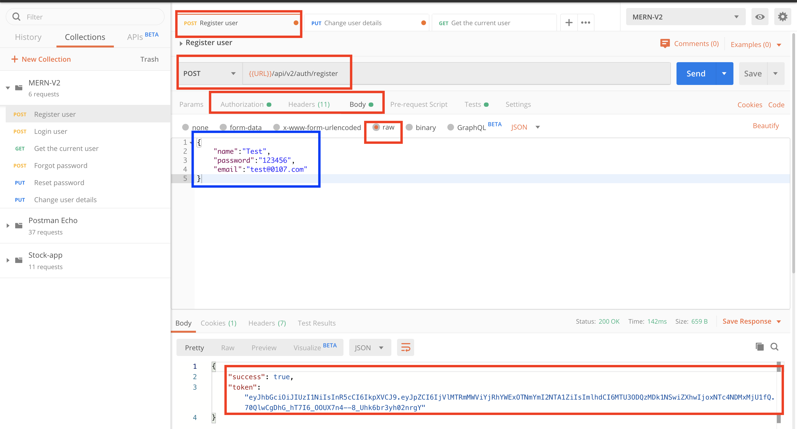
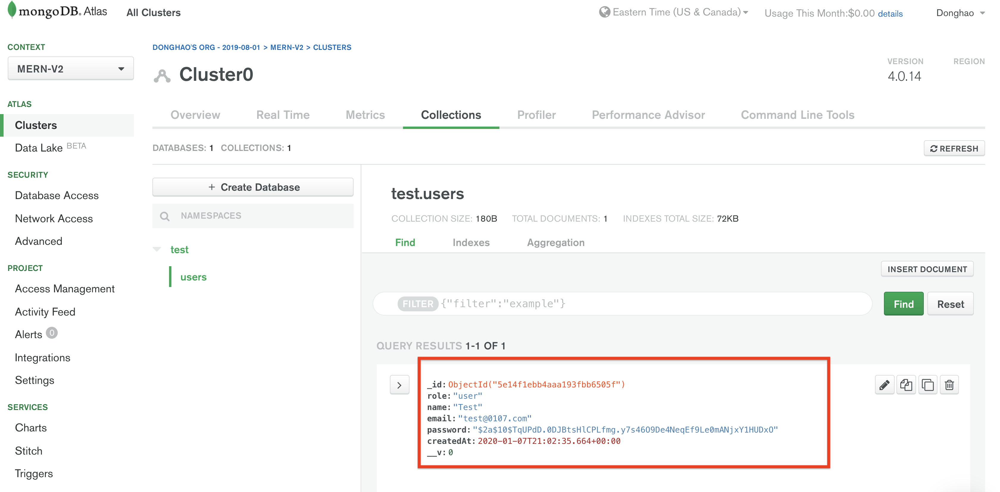
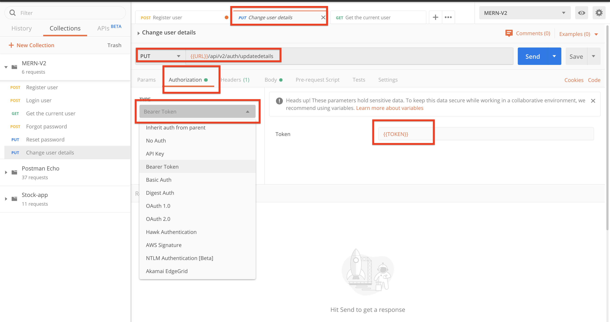
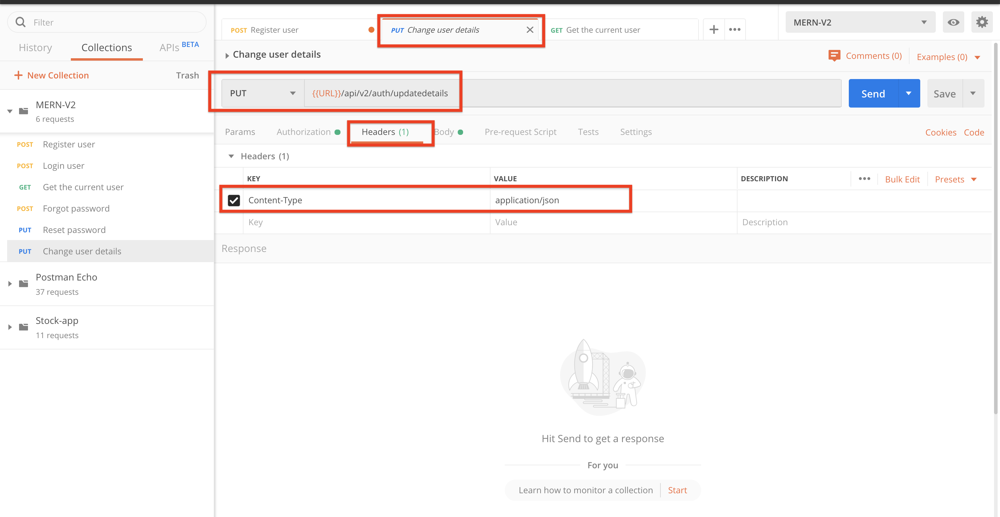
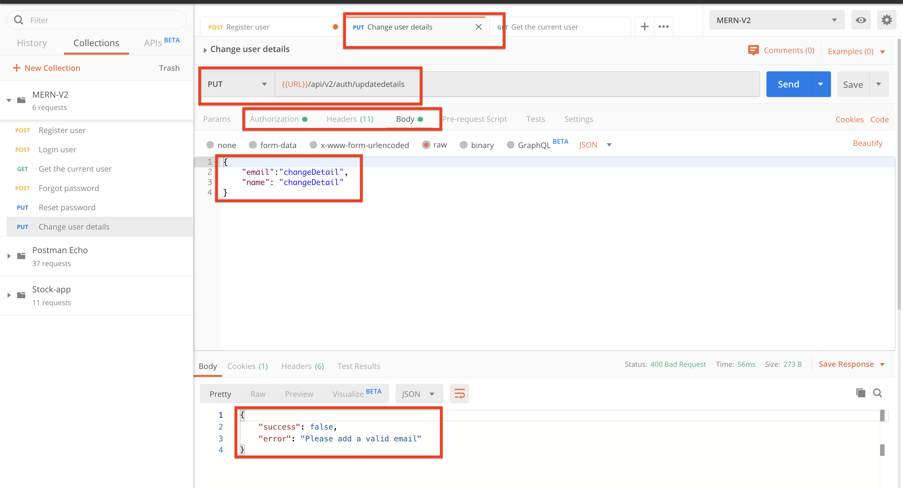
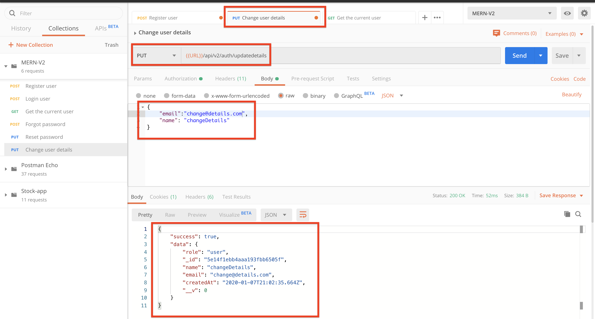
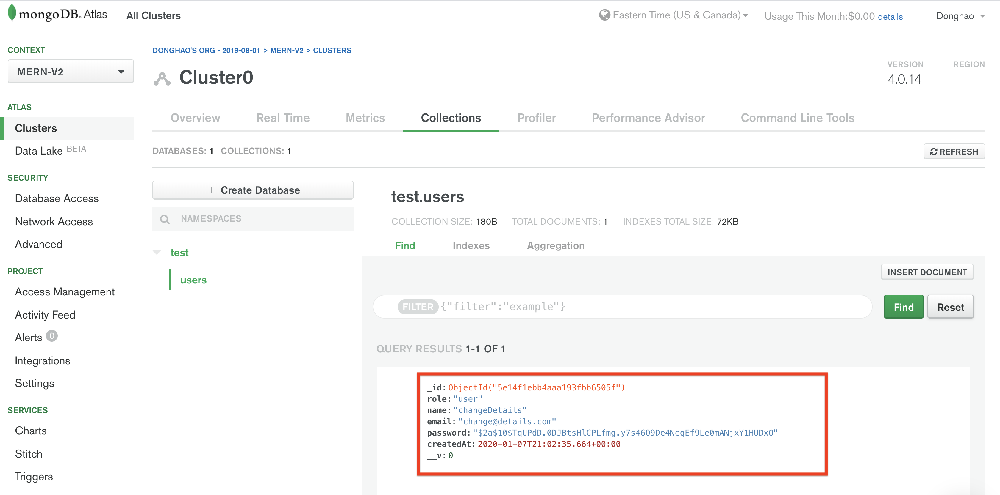
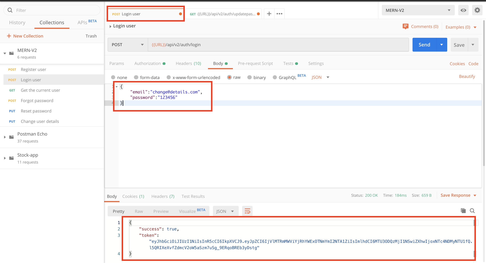
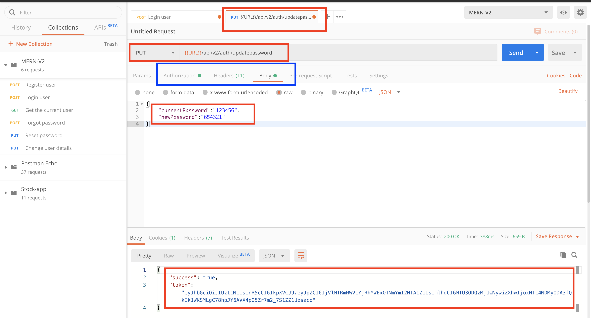

# MERN-Template-V2(part 6)

## `Section: Backend`(Update User APIs and Admin APIs)。

### `Summary`: In this documentation, we add update user apis & admin apis. 

### `Check Dependencies`

(Back-end)
- express (part1)
- dotenv (part1)
- morgan (part1)
- mongoose (part2)
- colors (part2)
- jsonwebtoken (part2)
- bcryptjs (part2)
- cookie-parser (part3)
- nodemailer(part5)
- crypto(part5)

(Dev-dependencies)
- nodemon (part1)

### Designing path:
1. 练习添加新的API。

### `Brief Contents & codes position.`
- 6.1 Add update details route endpoint middleware, `Location:./controllers/auth.js`
- 6.2 Add update password route endpoint middleware, `Location:./controllers/auth.js`
- 6.3 Add the two new route endpoint middlewares in route to two new apis, `Location:./apis/auth`

-------------------------------------------

- 6.4 Install nodemailer, create an account in mailtrap and set up some global variables.`Location:./config/config.env`
- 6.5 Add a new method in utils.`Location:./utils/sendEmail.js`
- 6.6 Add the new method in `forgotPassword` route endpoint middleware.`Location:./controllers/auth.js`

-------------------------------------------

- 6.7 Create route endpoint middleware(resetPassword), `Location:./controllers/auth.js`
- 6.8 Add the new route endpoint middleware in route to build reset password api, `Location:./apis/auth`

### `Step1: Add update email and name route endpoint middleware`
#### `Location:./controllers/auth.js`

```js
// @desc       Update user details
// @route      PUT /api/v2/auth/updatedetails
// @access     Private
exports.updateDetails = async (req, res, next) => {
    try {
        const fielsToUpdate = {
            name: req.body.name,
            email: req.body.email,
        }
        const user = await User.findByIdAndUpdate(req.user.id, fielsToUpdate, {
            new: true,
            runValidators: true,
        })

        res.status(200).json({
            success: true,
            data: user
        })

    } catch (err) {
        next(err);
    }
};
```

### `Comments:`
- 注意这里使用到的是部分修改user info的概念，跟第五部分修改resetPasswordToken和resetPasswordExpire，是相似的，但使用的工具是不一样的，这里需要多对比分辨。
- `这里也是常用的更新部分info的方法。`

### `Step2: Add update password route endpoint middleware`
#### `Location:./controllers/auth.js`

```js
// @desc       Update user password
// @route      PUT /api/v2/auth/updatepassword
// @access     Private
exports.updatePassword = async (req, res, next) => {
    try {
        const user = await User.findById(req.user.id).select('+password');
        if (!(await user.matchPassword(req.body.currentPassword))) {
            return next(new ErrorResponse('Password is incorrect', 401))
        }

        user.password = req.body.newPassword;
        await user.save();

        sendTokenResponse(user, 200, res)

    } catch (err) {
        next(err);
    }
};
```

### `Comments:`
- 注意这里使用读取用户时使用到`select('password')`, 然后经过对比原密码成功后直接保存，最后调用`sendTokenResponse`来保持登陆状态。
- 这里小结一下在本app里面用到了很多修改user info并保存在DB的不同方法，后期可以多总结。

### `Step3: Add the new route endpoint middleware in route to build new api.`
#### `Location:./apis/auth.js`

```js
const router = require('express').Router();
const {
    register,
    login,
    getMe,
    forgotPassword,
    resetPassword,
    updateDetails,
    updatePassword
} = require('../controllers/auth');

const { protect } = require('../middleware/auth')

router.post('/register', register);
router.post('/login', login);
router.get('/me', protect, getMe);
router.put('/updatedetails', protect, updateDetails);
router.put('/updatepassword', protect, updatePassword);
router.post('/forgotpassword', forgotPassword);
router.put('/resetpassword/:resettoken', resetPassword);

module.exports = router;
```

### `Comments:`
- 要注意新增的两个route endpoint middleware都是Private的，换句话说都需要protect middleware去验证用户是否登陆或者cookies里面的token是否有效。

### Step4 : TEST

- Register a new user.
<p align="center">

</p>

-----------------------------------------

<p align="center">

</p>


- Configure the new api request in postman.
<p align="center">

</p>

-----------------------------------------

<p align="center">

</p>

- Update details with wrong format.
<p align="center">

</p>

- Update details with valid format.
<p align="center">

</p>

- Update successfully.
<p align="center">

</p>

- Login with the user.
<p align="center">

</p>

- Input the current password and new password.
<p align="center">

</p>

- Login with old password.
<p align="center">

</p>

- Login with new password.
<p align="center">

</p>