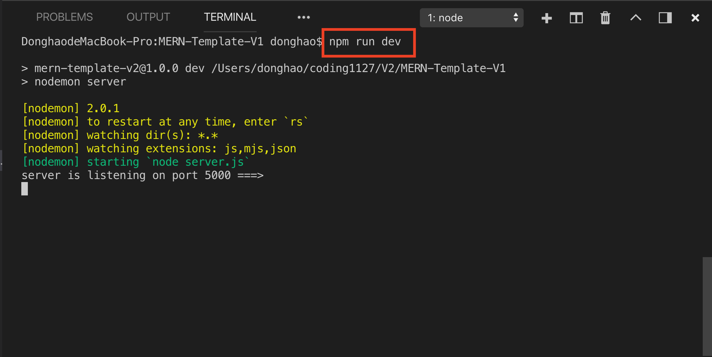
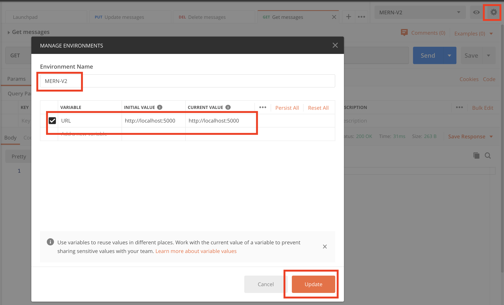
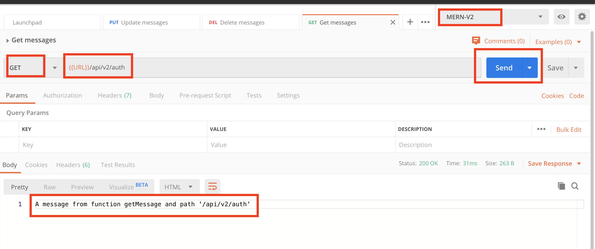
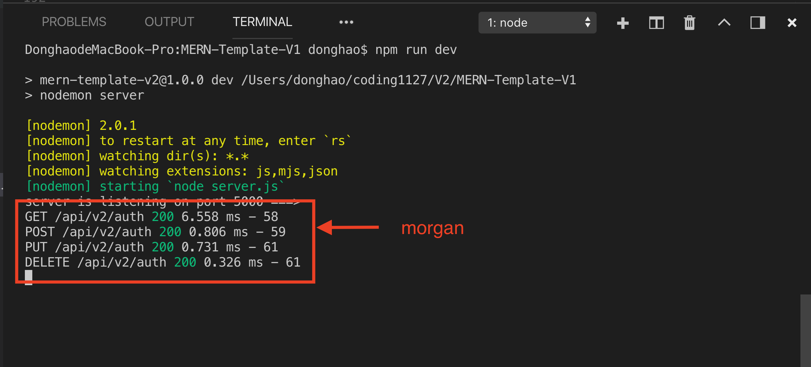

# MERN-Template-V2(part 1)

## `Section: Backend`(Refactor backend route)

### `Summary`: In this documentation, we refactor backend route by using seperate controller files.

### `Check Dependencies`

(Back-end)
- express (part1)
- dotenv (part1)
- morgan (part1)

(Dev-dependencies)
- nodemon (part1)

### `Brief Contents & codes position`
- 2.1 Add scripts in package.json, `Location:./package.json`
- 2.2 Add new file in config folder('config.env'), and ignore it `Location:./config/config.env`
- 2.3 Change some code in server.js, `Location:./server.js`
- 2.4 Add controllers folder in root directory, `Location:./`
- 2.5 Create a method file in controllers folder ('auth.js'), `Location:./controllers/auth.js`
- 2.6 Import the methods to route, `Location:./apis/auth.js`
- 2.7 Add a logger middleware (morgan), `Location:./server.js`

### `Step1:Add scripts in package.json`
#### `(*2.1)Location:./package.json`

```js
/*...*/
"scripts": {
    "start": "NODE_ENV = production node server.js",
    "dev": "nodemon server"
},
/*...*/
```

### `Step2:Add new file in config folder('config.env'), and ignore it `,
#### `(*2.2)Location:./config/config.env`

```js
NODE_ENV=development
PORT=5000
```

#### `(*2.3)Location:./.gitignore`

```bash
node_modules/
config/config.env
```

### `Step3: Change some code in server.js`
#### `Location:./server.js`

```js
//Load env vars
const dotenv = require('dotenv');
dotenv.config({ path: './config/config.env' });
const PORT = process.env.PORT || 5000;

//package
const express = require('express');

//Apply
const app = express();

/*
Routes here!!
*/
app.use('/api/v2', require('./apis'));

app.listen(PORT, () => console.log(`server is listening on port ${PORT} ===>`));
```

### `Comments:`

- Here we use dotenv instead of config dependency.
- The code about environment variables should be the very beginning of this file.
```js
const dotenv = require('dotenv');
dotenv.config({ path: './config/config.env' });
const PORT = process.env.PORT || 5000;
```
- Change the default route part to `/api/v2`, so every request will begin with `/api/v2`.

### `Step4: Add controllers folder in root directory`
#### `Location:./controllers`

### `Step5: Create a method js file in controllers folder, ('auth.js')`
#### `(*2.4)Location:./controllers/auth.js`

```js
// @desc       Get a message
// @route      Get /api/v2/auth
// @access     Public
exports.getMessage = (req, res, next) => {
    console.log('GET method');
    res.status(200)
        .send("A message from function getMessage and path '/api/v2/auth'")
}

// @desc       Create a message
// @route      Post /api/v2/auth
// @access     Public
exports.sendMessage = (req, res, next) => {
    console.log('POST method');
    res.status(200)
        .send("A message from function sendMessage and path '/api/v2/auth'")
}

// @desc       Update a message
// @route      Put /api/v2/auth
// @access     Public
exports.updateMessage = (req, res, next) => {
    console.log('PUT method');
    res.status(200)
        .send("A message from function updateMessage and path '/api/v2/auth'")
}

// @desc       Delete a message
// @route      Delete /api/v2/auth
// @access     Public
exports.deleteMessage = (req, res, next) => {
    console.log('DELETE method');
    res.status(200)
        .send("A message from function deleteMessage and path '/api/v2/auth'")
}
```

### `Step6: Import the methods to route`
#### `Location:./apis/index.js`

```js
const router = require('express').Router();

router.use('/auth', require('./auth'));

module.exports = router;
```

#### `(*2.5)Location:./apis/auth.js`

```js
const router = require('express').Router();
const {
    getMessage,
    sendMessage,
    updateMessage,
    deleteMessage
} = require('../controllers/auth')

router.route('/')
    .get(getMessage)
    .post(sendMessage)
    .put(updateMessage)
    .delete(deleteMessage);
```

### `Comments:`

- This is the most important step in this part.
- We import the methods from other files and use them in our route.
- Current route is `/api/v2/auth`

### `Step7: Add a logger middleware (morgan)`
#### `(*2.6)Location:./server.js`

```js
//Load env vars
const dotenv = require('dotenv');
dotenv.config({ path: './config/config.env' });
const PORT = process.env.PORT || 5000;

//packages
const express = require('express');
const morgan = require('morgan');

//Apply
const app = express();

//Middlewares
if (process.env.NODE_ENV === 'development') {
    app.use(morgan('dev'));
}

/*
Routes here!!
*/
app.use('/api/v2', require('./apis'));

app.listen(PORT, () => console.log(`server is listening on port ${PORT} ===>`));
```

### `Comments:`

- Environment variables should be the very beginning of the file.
- Route middlewares should be right between `const app = express();` and `app.use('/api/v2', require('./api'));`.
- morgan is a logger dependency, it will show the details of each request.

### Step8 : TEST

- Run command in git bash.
<p align="center">

</p>

- Set up postman environment.
<p align="center">

</p>

- Send a request then get the respond back.(Here just show one of four).
<p align="center">

</p>

- morgan is working.
<p align="center">

</p>
